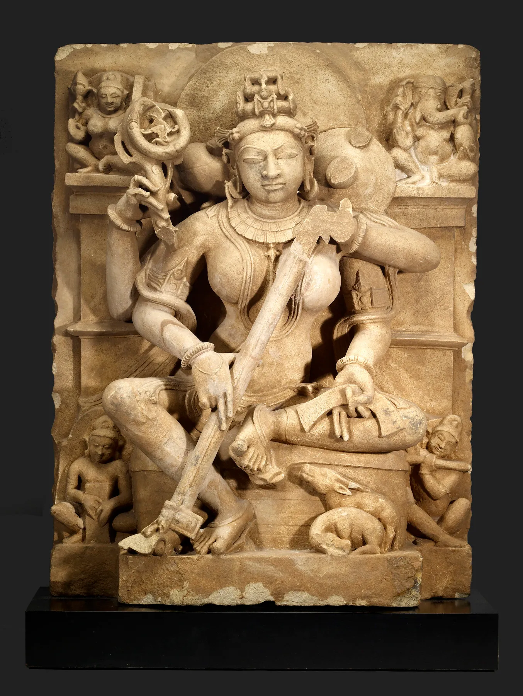

༺ ༼ 𑀐𑀁 ༽ ༻

༺ ༼ ॐ ह्रीं ऐं ह्रीं ॐ वाग्देव्यै नमः ༽ ༻

<figure>
  
  <figcaption>FIGURE 1: Four-armed Shrimati Sarasvati (c. 10th–11th century), soapstone, Walters Art Museum.</figcaption>
</figure>
 
 
Four-armed Shrimati Sarasvati (c. 10th - 11th century), image by The Walters Art Museum, with a (cc) Creative Commons Licence. Carved from soapstone native to Uttar Pradesh, Northern India, where the sculpture was also initially sited. Sculpture dimensions sans base: height: 71.2 cm; width: 55.6 cm; depth: 24.4 cm. Acquired in Varanasi (?), India, in 1969 by The Walters Art Museum, Baltimore, Maryland, U. S. A. The Goddess of Music, Learning and the Arts, plucks the Veena, a stringed musical instrument, whilst holding a palm leaf manuscript in Her left rear hand, which rests on the calve of Her left leg. The divine attribute of the Manuscript, alludes to Her domain of Knowledge, particularly Sacred Knowledge, which the goddess guards and protects. Maa Saraswathi is worshipped pervasively throughout the Dharmic Traditions, within the Sanatana Dharma (Hindus), Jaina Dharma and Buddhists Dharma traditions, amongst others, all of which worship Sarasvati, having adapted Her from earlier Animist traditions, which held that all natural objects are sentient and enspirited and have a spiritual nature or essence. Sarasvathi, takes Her name from a formerly significant river in India, that once flower all the way to the coast (now largely dry, though flows intermittently, post-deluge). Maa Sarasvati is an ancient riverine deity, who personifies the abundant gifts and bounty bestowed by the river, not least of which was the provision of life-giving water to support life in the region, and also the provision of invaluable irrigation for crops and livestock. Legends of Her beneficence extended to Her bestowal of Knowledge, the Divine Word (from Sri Vac Devi, with whom She synchronised), and Sound, to humankind, especially amongst later Sanatana Dharma (Hindu) traditions. ॐ ह्रीं ऐं ह्रीं ॐ वाग्देव्यै नमः ||

# Annotated Bibliography (3B: L - Z) of the English translation of the 'Gautamiya Samhita' or 'Gautamiya Mahatantram', a Vaishnava Tantric Pancharatra Agama, with extensive Frontmatter & Introduction #

by Sri Nagahari-dasa a.k.a. Beauford A. Stenberg

**Note:** The (1A & 1B): Frontmatter and extensive Introduction and Survey-of-the- Field the (2A & 2B): Sanskrit original and Hindi commentary, along with annotations, English translation, analysis and commentary, will be complemented by (3A: A - K & 3B: L -Z): this Annotated Bibliography. All three (3) will be progressively and incrementally published in Medium separately, as complimentary living documents, due to publication number-of-word restrictions per published page, according to Medium (online) Webmaster's site policy and the electronic medium, proper. I may also institute (4): An Index of sorts, to collectively house a Table-of-Contents (TOC), and hypertext linkages, to assist ease of electronic navigation and wayfinding, for my audience. I have resolved not to place this work behind a paywall. That said, I reserve the right to review that determination in future, once the work has been well-progressed and well onway to realisation.

༺ ༼ **Hari Aum Tat Sat** ༽ ༻

## Annotated Bibliography ##

# L #

### LAI, W.; *et al* ###

* Lai, Whalen & Lancaster, Lewis R. (eds.) (1983). 'Early Ch'an in China and Tibet'. Berkeley Buddhist Studies Series №5. Berkeley, California, U. S. A.: Asian Humanities Press. Source: https://terebess.hu/zen//mesterek/WhalenLai.pdf (accessed: Friday, June 28, 2024) 

**Purport:** 
…

### LAKSHMITHATHACHAR, M.; *et al.* ###

* Lakshmithathachar, M. A. (ed. & trans.) & Varadachari, V. (rev.) (2009). 'Ishvarasamhita: Critically Edited and Translated in Five Volumes - Vol. IV, (Chapters XIX - XXIII)'. Sanskrit set in Devanagari with English translation. Set of five (5) volumes. Janpanth, New Delhi, India: Indira Gandhi National Centre for the Arts in association with Jagawahar Nagar, Delhi, India: Motilal Banarsidass Publishers Pvt. Ltd. ISBN 9788120832169 (Set). ISBN 9788120832006 (Vol. IV). Source: https://archive.org/details/isvarasamhita04sanskritengtranslbyvvaradachariandgtripathi (accessed: Tuesday, June 25, 2024) 

**Purport:** 
This item is the fourth of five volumes of a suite. The first volume of which, is my principal secondary resource. It took me circa three (3) weeks of solid work of protracted research and endeavour to realise it. It was not been cited in any work I have so far read. The first volume out of five (5), is effectively a monograph on the Pancharatra as a class. It is the first substantive monographic work on the topic in English, that I have secured. As such, I cherish it greatly as my guiding light and I am actually unwrapping it ever-so-slowly, savouring and integrating each sip of the nectarine elixir and fully digesting it, before progressing. Actually, before fully progressing my study of this work and progressing with the Gautamiya Mahatantram translation, I have somewhat been seduced into translating an emic Hindi work on Vaishnava Tantra, geared towards academically oriented to the cohort of the young adult Vaishnava, but is of course useful for those outside this cohort, as an entry into the topic, and the doctrine and sadhana proper, which it treates. I actually anticipate, that I will progress the translations incrementally in tandem. NB: Beauford, reference and file the other four (4) volumes.

### LARSON, G.; *et al.* ###

* Larson, Gerald James & Bhattacharya, Ram Shankar (eds.) (1987). 'Samkhya: A Dualist Tradition in Indian Philosophy'. Encyclopedia of Indian Philosophies Vol. 4. Jawahar Nagar, Delhi, India: Motilal Banarsidass. ISBN 8120803116 (Vol. 4)

**Purport:** 
…

### LAWRENCE, D. ###

* Lawrence, David Peter (1992). 'Argument and the Recognition of Shiva: The Philosophical Theology of Utpaladeva and Abhinavagupta'. Dissertation. The Faculty of the Divinity School. Chicago, Illinois, U. S. A.: The University of Chicago. Source: https://archive.org/details/argumentrecognitionofsivaphilosophicaltheologyofutpaladevaandabhinavaguptadavidpeterlawrencethe_540_H (accessed: Friday, July 12, 2024)

**Purport:** 
…

### LEACH, R. ### 

* Leach, Robert (2012). 'Textual Traditions and Religious Identities in the Pancharatra'. Edinburgh, Scotland, U. K.: The University of Edinburgh. Source: xxx

**Purport:** 
…

* Leach, Robert (2019). 'Renegotiating Ritual Identities: Blurred Boundaries Between Pancharatra Ritual Communities in South India' (pp. 107–135) in Mirnig, Nina; Rastelli, Marion & Eltschinger, Vincent (eds.) (2019). *Tantric Communities in Context*. 'Austrian Academy of Sciences \[German: Österreichische Akademie der Wissenschaften]'. 'Philosophical-Historical Class, Proceedings, Vol. 899 \[German: Philosophisch-Historische Klasse Sitzungsberichte, 899]'. 'Contributions to the Cultural and Intellectual History of Asia, №99 \[German: Band Beiträge zur Kultur- und Geistesgeschichte Asiens, Nr. 99]'. 'Edited by the Institute for Cultural and Intellectual History of Asia under the direction of Birgit Kellner \[German: Herausgegeben vom Institut für Kultur- und Geistesgeschichte Asiens unter der Leitung von Birgit Kellner]'. Vienna, Austria: Austrian Academy of Sciences Press \[German: Osterreichische Akademie der Wissenschaften]. (Note: In English, though bibliographic details are in German.). ISBN 9783700183785. Source: https://archive.org/details/mirnig-nina-rastelli-marion-eltschinger-vincent-eds.-2019.-tantric-communities-in-context (accessed: Friday, August 23, 2024)

**Purport:** 
…

### LESHNIK, L.; *et al.* ###

* Leshnik, Lawrence Saadia & Sontheimer, Günther-Dietz (eds.) (1975). 'Pastoralists and Nomads in South Asia'. Weisbaden, Hesse, Germany: Otto Harrassowitz. ISBN 9783447015523.

**Purport:** 
This work has the first publishing of an essay that I needsmust secure: Vaudeville, Charlotte (1975). 'The Cowherd God in Ancient India'. It has received the second publishing in another work, which has also received a second printing: Vaudeville & Dalmia (1999, 1996). As of July 2, 2025, I have secured a copy of Leshnik & Sontheimer (1975) and thereby, Vaudeville (1975).

### LESLIE, JR.; D. ###

* Leslie, Jr.; David M. (2010). 'Procapra picticaudata (Artiodactyla; Bovidae) \[Tibetan gazelle, goa]' (pp. 138–148) in *Mammalian Species*, Vol. 42, Issue 86, 2010. New York, N. Y., U. S. A.: American Society of Mammalogists. Source: https://archive.org/details/leslie-jr.-david-m.-2010.-procapra-picticaudata-artiodactyla-bovidae-tibetan-gazelle-goa (accessed: Thursday, June 27, 2024)

**Purport:** 
This article is the synthesis and digest of a vast number of sources, which it cites.

### LESTER, R. ###

* Lester, Robert C. (1994). 'The Sattada Sri-Vaishnavas' (pp. 39–53) in the *Journal of the American Oriental Society*, Vol. 114, №1, Jan. - Mar., 1994. Ann Arbor, Michigan, U. S. A.: American Oriental Society. Source: https://archive.org/details/lester-robert-c.-1994.-the-sattada-sri-vaishnavas (accessed: Friday, September 13, 2024)

**Purport:** 
As soon as I saw "sāttāda", my intuition told me it was a Romanised Tamilization with diacritics, of the Sanskrit "sātvata" or "sāttvata". On reading the article, Lester surrenders this point, but only in passing.

### LEWIS, B. ###

* Lewis, Brenda Ralph (2001a). 'Ritual Sacrifice: A Concise History (An Illustrated History)'. Phoenix Mill, Thrupp, Stroud, Gloucestershire, England, U.K.: Sutton Publishing. ISBN 1750927070.

**Purport:**
This work is strong and there is such silence around it.

* Lewis, Brenda Ralph (2001b). 'The Nature of Sacrifice: An Overview' (pp. 1-11) in Lewis, Brenda Ralph (2001a). *Ritual Sacrifice: A Concise History (An Illustrated History)*. Phoenix Mill, Thrupp, Stroud, Gloucestershire, England, U.K.: Sutton Publishing. ISBN 1750927070.

**Purport:**
...

* Lewis, Brenda Ralph (2001c). 'Twilight of the Gods' (pp. 65-79) in Lewis, Brenda Ralph (2001a). *Ritual Sacrifice: A Concise History (An Illustrated History)*. Phoenix Mill, Thrupp, Stroud, Gloucestershirev England, U.K.: Sutton Publishing. ISBN 1750927070.

**Purport:**
...

* Lewis, Brenda Ralph (2001d). 'A Sacred Profusion: The Indian Subcontinent' (pp. 113-126) in Lewis, Brenda Ralph (2001a). *Ritual Sacrifice: A Concise History (An Illustrated History)*. Phoenix Mill, Thrupp, Stroud, Gloucestershirev England, U.K.: Sutton Publishing. ISBN 1750927070.

**Purport:**
...

* Lewis, Brenda Ralph (2001e). 'Steppes to Salvation: Central Asia and China' (pp. 127-144) in Lewis, Brenda Ralph (2001a). *Ritual Sacrifice: A Concise History (An Illustrated History)*. Phoenix Mill, Thrupp, Stroud, Gloucestershirev England, U.K.: Sutton Publishing. ISBN 1750927070.

**Purport:**
...

### LIDKE, J. ***

* Lidke, Jeffrey (2014). 'Transcendental Devotion (anuttara-bhakti): The Recognition of Deity as Self in the Nondual Tantra of Abhinavagupta'. Paper to be read at the 12th Annual DANAM Conference, November 22, 2014, San Diego, California. Unpublished draft. Source: xxx

**Purport:** 
...

* Lidke, Jeffrey S. (2016). 'A Thousand Years of Abhinavagupta' in *Sutra Jounal [online]*, January, 2016. Source: http://www.sutrajournal.com/a-thousand-years-of-abhinavagupta-by-jeffrey-lidke (accessed: Friday, July 12, 2024). Source: https://archive.org/details/lidke-jeffrey-s.-2016.-a-thousand-years-of-abhinavagupta (accessed: Friday, July 12, 2024)

**Purport:** 
...

### Li, M. ###

* Li, Mengyan (2018). 'Origination, Transmission, and Reception of the Phur-pa Cycle: A Study of the rDo-rje-phur-pa Cycle of Tantric Teachings in Tibet with Special Reference to Sog-bzlog-pa Blo-gros-rgyal-mtshan's (1552–1624) Phur pa'i lo rgyus'. Dissertation for the Doctor of Philosophy in Tibetology at the Faculty of Humanities (South Asian Studies). Hamburg, Germany: University of Hamburg. Source: https://archive.org/details/li-mengyan-2018.-origination-transmission-and-reception-of-the-phur-pa-cycle-a-s (accessed: Monday, June 17, 2024)

**Purport:** 
This work is definitely informed by the vast amount of work and citations, I uploaded and published in English Wikipedia, from a number of articles, but particularly the now renamed and defunct English Wikipedia article that I inaugurated, populated and cited, and named 'Kīlā (Sanskrit)', later changed by others to 'Buddhism', which I disagreed with. Even Boord personally contributed to the article, amongst other Tibetologists and Sanskritists. This dissertation even utilises some of my specific terms of phrase, unattributed. My writing and referencing style is idiosyncratic and distinctive. Especially, when my writing is decidedly polished, through much toil. I consider myself a jeweller. I write, often spontaneously. Then, slowly, meticulously, painstakingly and methodologically: facet, filigree, and fashion cabochons and cameos of concept and language. I find it annoying and disconcerting, that some scholars, such as Li, feel they do not need to cite Wikipedia, when their work has drawn and benefited extensively from it. I feel, and it is my concerted opinion, that the time has long since passed when Academia and the bastions of scholarship, could deprecate and disparage the contribution of the suite of Wikimedia projects, and all those (mostly) anonymous, selfless, contributions, of mostly non-academically trained, non-professionals, to iterate and inform global discourse, knowledge and information dissemination, and the subsequent leavening of the global scholarship of Academia and institutional pedagogy and traditions of scholarship. The Wikimedia projects and their synthesis and showcase of human knowledges and discourse confluence, has profoundly altered the 'Human Condition' and 'The Spirit of the Age', since its inception. Well, this position, I tender, proffer and defend.

### LINDER, S. ###

* Linder, Silvia Schwarz (2012). 'The Philosophical and Theological Teachings of the Padma-Samhita'. Ph.D. dissertation. Vienna, Austria: 'University of Vienna' \[German: Universitat Wien]'. Source: https://archive.org/details/linder-silvia-schwarz-2012.-the-philosophical-and-theological-teachings-of-the-padma-samhita (accessed: Tuesday, August 20, 2024)

**Purport:** 
"This dissertation deals with the Pādmasamhitā (PādS), a Sanskrit work of South Indian origin, belonging to the Pāñcarātra, composed between the XII and XIII century A. D.. Information about the period and features of composition of the work, its structure and contents is given in the Introduction of the dissertation; methodological issues and the chief results of the research are also therein discussed. The first part is devoted to philosophical and theological teachings of the PādS. The chapter on the doctrine of God deals with the concept of the threefold manifestation (i.e. the Highest Vāsudeva, puruşa and prakŗti) of the Supreme Being, which is influenced by Yādavaprakāśa's idea of the unfolding of brahman in its three manifestations (aņśa); the relational aspect of the godhead, concretized in the presence of God in meditation and ritual worship, is elucidated. The chapter on the individual soul deals with the origination of the jīva-s, their involvement in saņsāra and their striving after emancipation. The chapter on the doctrine of liberation illustrates both the concept of mukti as union between individual souls and Supreme Soul, and the idea of a fourfold liberation. The second part is devoted to yoga. The first two chapters discuss problems concerning the text and structure of the yogapāda and reassess the idea of the "limbs" of yoga. In the third and fourth chapter some elements of subtle physiology, together with certain psycho-physical practices of the yogin are illustrated. The last chapter, devoted to the religious dimension of yoga, discusses the following: the function of the yogic disciplines in the yoga-permeated ritual system of the PādS; the importance of yogic meditation (dhyāna) in religious life and spiritual experiences of the devotee; the ritual practice of yogic suicide as a means of hastening final emancipation."

* Linder, Silvia Schwarz (2014). 'The Philosophical and Theological Teachings of the Padmasamhita'. (In English, but all bibliographic details are in German.). 'Austrian Academy of Sciences, Philosophical-Historical Class, Proceedings, Volume 853 \[German: Österreichische Akademie der Wissenschaften Philosophisch-Historische Klasse sitzungsberichte, 853.]'. 'Contributions to the Cultural and Intellectual History of Asia, №82 \[German: Band Beiträge zur Kultur- und Geistesgeschichte Asiens Nr. 82.]'. Vienna \[German: Wien], Austria: 'Austrian Academy of Sciences Press \[German: Österreichische Akademie der Wissenschaften]'. ISBN 9783700175520. Source: https://archive.org/details/linder-silvia-schwarz-2014.-the-philosophical-and-theological-teachings-of-the-padmasamhita (accessed: Saturday, July 27, 2024)

**Purport:** 
This is a premier monograph on the *Sri Padma Samhita* of the Pancharatra tradition. It has undergone anonymous international peer review.

### LINGPA, J.; *et al* ###

* Lingpa, Jigme (auth.) & Gyatso, Janet (trans.) (1998). 'Apparitions of the Self: The Secret Autobiographies of a Tibetan Visionary; A Translation and Study of Jigme Lingpa's Dancing Moon in the Water \[Tibetan: གསང་བ་ཆེན་པོ་ཉམས་སྣང་གི་རྟོགས་བརྗོད་ཆུ་ཟླའི་གར་མཁན་; Wylie: gsang ba chen po nyams snang gi rtogs brjod chu zla'i gar mkhan] and Dakki's Grand Secret Talk \[Tibetan: ཀློང་ཆེན་སྙིང་ཐིག་ལེའི་རྟོགས་པ་བརྗོད་པ་དཀའ་འཁྲུལ་གསང་བཏམ་ཆེན་མོ་; Wylie: klong chen snying thig le'i rtogs pa brjod pa dAkki'i gsang gtam chen mo]'. Princeton, New Jersey, U. S. A.: Princeton University Press. ISBN 0691011109 (cloth: alk. paper). Source: xxx

**Purport:** 
...

### LITVINSKY, B. ###

* Litvinsky, B. A.; Guang-da, Zhang & Samghabadi, R. Shabani (eds.) (1996). 'The History of Civilizations of Central Asia Vol. 3 - The Crossroads of Civilization: A.D. 250–750'. Multiple History Series. With s Preface by Federico Mayor. Paris, France: UNESCO Publishing (United Nations Educational, Scientific & Cultural Organization). ISBN 9231032119. Source: https://archive.org/details/HistoryOfCivilizationsOfCentralAsia (accessed: Monday, September 09, 2024)

**Purport:** 
...

### LoBUE, E. ###

* LoBue, Erberto (1981). 'Himalayan Sculpture in the 20th Century: A Study of the Religious Statuary in Metal and Clay of the Nepal Valley and Ladakh'. Thesis. London, England, U. K.: School of Oriental and African Studies (SOAS) (University of London). Source: https://archive.org/details/lo-bue-erberto-1981.-himalayan-sculpture...-20th-century-...-religious-statuary. (accessed: Thursday, July 25, 2024)

**Purport:** 
...

* LoBue, Erberto (1997). 'The Role of Newar Scholars in Transmitting the Indian Buddhist Heritage to Tibet' (pp. 629–658) in Karmay, Samten G. & Sagant, Philippe (eds.) (1997). *Les habitants du toit du monde: etudes recueillies en hommage a Alexander W. Macdonald*. Recherches sur la Haute Asie Vol. 12. Text in French and English. Nanterre: Société d'ethnologie. ISBN 9782901161493.

**Purport:** 
It has been digitised and is a part of the HathiTrust Digital Library as of 2010. I have not yet been able to secure a copy of this article.

### LOCHTEFELD, J. ###

* Lochtefeld, James G. (2002). 'The Illustrated Encyclopedia of Hinduism'. First edition. (Note: Two volumes in one.). New York, N. Y., U. S. A.: The Rosen Publishing Group, Inc. ISBN 0823922871 (set). Source: https://archive.org/details/lochtefeld-james-g.-2002.-the-illustrated-encyclopedia-of-hinduism (accessed: Monday, September 02, 2024)

**Purport:** 
...

### LOKESWARANANDA ###

* Lokeswarananda, Swami (ed.) (1989). 'Studies on the Tantras'. Gol Park, Calcutta, West Bengal, India: The Ramakrishna Mission Institute of Culture. Source: https://archive.org/details/RamakrishnaMissionStudiesOnTheTantras (accessed: Sunday, August 18, 2024)

**Purport:** 
This is an excellent volume of quality material.

### LONG, J.; *et al.* ###

* Long, Jeffery D.; Sherma, Rita D.; Jain, Pankaj & Khanna, Madhu (eds.) (2022). 'Hinduism and Tribal Religions'. Encyclopedia of Indian Religions series. Dordrecht,The Netherlands: Springer. ISBN 9789402411881 (ebook). Source: xxx

**Purport:** 
This is an excellent volume to inform the Lexicon.

### LUBOTSKY, A. ###

* Lubotsky, Alexander (2007, 2001, 1999). 'The Indo-Iranian Substratum' (pp. 301–317) in Carpelan, Christian; Parpola, Asko & Koskikallio, Petteri (eds.) (2007, 2001). 'Early Contacts between Uralic and Indo-European: Linguistic and Archaeological Considerations - Papers Presented at an International Symposium Held at the Tvärminne Research Station of the University of Helsinki, January 8–10, 1999'. 'Publications of the Finno-Ugrian Society \[Finnish: Suomalais-Ugrilaisen Seuran Toimituksia]'. 'Memoirs of the Finno-Ugrian Society Vol. 242 \[French: Mémoires de la Société Finno-Ougrienne 242]. Second edition. (Note: First edition published in 2001, Vammala). Helsinki, Finland: Suomalais-Ugrilainen Seura. ISBN 9525150593. Source: https://archive.org/details/carpelan-c.-parpola-a.-koskikallio-p.-eds.-2007-2001.-early-contacts-between-ura (accessed: Saturday, August 31, 2024)

**Purport:** 
...

# M #

### MADHAVA, V. ###
* Madhava, Vidyaranya (auth.); K. V., Subbaratnam (trans. & notes) & K. R., Venkataranan (intr.) (1972). 'Shrimad Shankara Digvijaya' (Sanskrit: श्रीमच्छङ्करदिग्विजयः ; IAST: Śrīmacchaṅkaradigvijayaḥ). With an Introduction in English by K. R. Venkataraman. A Translator's Note in English by K. V. Subbaratnam. With Sanskrit original in Devanagari and English translation. Publisher: Akhil Bharat Shankara Seva Samiti (Sanskrit: अखिलभारतशङ्कर सेवासमितिः; IAST: Akhilabhārataśaṅkara Sevāsamitiḥ; English: All India Shankara Service Committee). Source: https://archive.org/details/dli.ernet.383653 (accessed: Friday, July 04, 2025)

**Purport:** 
Unfortunately, though this bilingual edition has the original Sanskrit and an English rendering, they are not juxtaposed and usefully interspersed for probity, which is unfortunate.

### MADHAVANANDA ###

* Madhavananda, Swami (1989). 'The Tantric Mode of Worship' (pp. 1–5) in Lokeswarananda, Swami (ed.) (1989). *Studies on the Tantras*. Gol Park, Calcutta, West Bengal, India; The Ramakrishna Mission Institute of Culture. Source: https://archive.org/details/RamakrishnaMissionStudiesOnTheTantras (accessed: Sunday, August 18, 2024)

**Purport:** 
...

### MAHADEVA, A. ###

* Mahadeva, A. \[Sanskrit: ए. महादेव शास्त्री ; IAST: E. Mahādeva Śāstrī.] (trans.) (c1907). 'The Vedanta-Sutras with Srikantha Bhashya'. \[Note: As originally appeared in 'The Light of Truth: The Siddhanta Deepika and Agamic Review', Vols. 1–7, June 1897 - March 1907.] Source: https://archive.org/details/TheVedantaSutrasWithSriKanthaBhashya_201712 (accessed: Friday, August 02, 2024)

**Purport:** 
'Pandit Alladi Mahadeva Shastri' (Sanskrit: पण्डित अल्लादि महादेव शास्त्री ; IAST: Paṇḍita Allādi Mahādeva Śāstrī) was the Director of the Oriental Section of the Adyar Library from 1916 until his death in 1926. No information is provided about editor, publisher, locality or date of this recent independently and self-published edition of the work of Mahadeva that was initially published as a serialised translation, with dates as stated. So, I have attributed a rather curious circa date to the edition as a retrospective, given that for a desktop published affair, it demonstrates technological proficiency and academic precision and has been well-edited and adepty proofed. The technical name for this commentary by Srikantha following Duquette (2021: p. 2), is the 'Sri Brahma-Mimamsa-Bhashya' (Sanskrit: श्रीब्रह्ममीमांसाभाष्य ; IAST: Śrībrahmamīmāṃsābhāṣya). The commentator Srikantha (Sanskrit: श्रीकण्ठ शिवाचार्य ; IAST: Śrīkaṇṭha Śivācārya, alternately Sanskrit: नीलकण्ठ शिवाचार्य ; Nīlakaṇṭha Śivācārya) upholds the Shaiva Vishishtadvaita Siddhanta. As per Ramesan (1972: p. 67), we do not know whether Srikantha flourished before or after Ramanuja. Subramuniyaswami (2004, 1998: p. 843) gives the uncited date of circa 1050 CE for Srikantha and that would make him contemporaneous with Ramanuja and then states that the Shaiva Vishishtadvaita was "Patterned after the Vaishṇavite Viśishṭādvaita of Ramanuja, this philosophy was later amplified by Appaya Dikshitar.". Duquette (2021: p. 2), after providing details of a number of scholarly works that treat Srikantha and his dates, compositions and commentaries, states that he flourished circa 14th - 15th centuries, so well post-Ramanuja.

### MAHANTI, J. ###

* Mahanti, J. C. (2014). 'The Saga of Jagannatha and Badadeula at Puri (Story of Lord Jagannatha and His Temple)'. First edition. VIJ Books (India) Pty. Ltd. ISBN 9789382652311. Source: xxx

**Purport:** 
I have only been able to source a potential electronic edition of this work through a Kindle edition via Amazon.com or via payed membership to Perlego. As yet, I have pursued neither option.

### MAHESHANANDA; *et al.* ###

* Maheshananda, Swami & Sharma, B. R., *et al.* (eds.) (2003, 1984). 'Vashishtha Samhita (Yoga Kanda) \[Sansrit: श्री वशिष्ठसंहिता (योग-काण्ड); IAST: Śrī-Vaśiṣṭhasaṃhitā (Yoga-Kāṇḍa)]'. Revised edition. Lonavla, Pune, Maharashtra, India: Kaivalyadhama S.M.Y.M. Samiti. ISBN 8189485377.

**Purport:** 
With the play of scripts and dialectical variation, as well as different transliteration conventions and concommitant carelessness or non-standardisation in romanisation, I have noticed the name of the Rishi Vashishta transliterated and spelt in Latin characters variously. Maheshananda & Sharma, *et al.* (2003) uses ....

### MAIRS, R. ###

* Mairs, Rachel (ed.) (2021). 'The Graeco-Bactrian and Indo-Greek World'. Routledge Worlds series. Milton Park, Abingdon, Oxon, England, U. K.: Routledge (an imprint of the Taylor & Francis Group). ISBN 9781315108513 (ebook). Source: https://archive.org/details/mairs-rachel-ed.-2021.-the-graeco-bactrian-and-indo-greek-world (accessed: Saturday, September 14, 2024)

**Purport:** 
...

### MAJEED, G. ###

* Majeed, Gulshan (2011). 'No Naga Presence in Ancient Kashmir' in Khawaja, G. M. & Majeed, Gulshan (eds.) (2011). *Approaches to Kashmir Studies*. Srinagar, Kashmir, India: Gulshan Books. ISBN 9788183390132. ISBN 8183390137. ISBN 9788180000000.

**Purport:** 
This article and the volume within which it is inset, would be most useful for our purposes. Unfortunately, as yet, I have been unable to secure either. Useful direct quotations from it, along with its arguments and position are given voice in Ahmad (2017).

### MAJUMDAR, R. ###

* Majumdar, Ramesh Chandra (1956). 'Evolution of Religio-Philosophic Culture in India' (pp. 31–62) in Bhattacharyya, Haridas (ed.) (1956). *The Cultural Heritage of India: Vol. 4, The Religions*. With a Publisher's Note by Swami Nityaswarupananda. With a Preface by Suniti Kumar Chatterji. With an Introduction by Bharataratna Bhagavan Das. (Note: First edition of 3 volumes published in 1937. Second edition of 5 volumes, revised and enlarged.). Calcutta, India: The Ramakrishna Mission Institute of Culture (Swami Nityaswarupananda). Source: https://archive.org/details/bhattacharyya-haridas-ed.-1956.-the-cultural-heritage-of-india-vol.-4-the-religions (accessed: Friday, August 16, 2024)

**Purport:** 
This work contains a very useful section entitled: 'Bhāgvata-Pāñcharātra-Vaishṇava Cult' (pp. 780–793).

### MAJUMDAR, R.; *et al.* ###

* Majumdar, R. C. & Dasgupta, K. K. (eds.) (1982). 'A Comprehensive History of India: Vol. 3, Part 2 (A. D. 300–985)'. With a Foreword by Satish Chandra. New Delhi, India: People's Publishing House (published under the auspices of The Indian History Congress). Source: https://archive.org/details/in.ernet.dli.2015.98115 (accessed: Friday, August 30, 2024)

**Purport:** 
This work contains a very useful section entitled: 'Bhāgvata-Pāñcharātra-Vaishṇava Cult' (pp. 780–793).

### MALAVIYA, R. ###

* Malaviya, Dr. Ramaji (ed.) (1992). 'Gautamiyamahatantram of Maharshi Gautama'. With a Foreward in Sanskrit by Dr. Vidyaniwas Misra. Yogatantra-Granthamala Vol.14. First edition. Varanasi, India: Dr. Harish Chandra Mani Tripathi, Sampurnanand Sanskrit University. Source: https://archive.org/details/wqyJ_gautamiya-maha-tantram-of-maharsi-gautama-with-dr.-vidyaniwasas-mishra-by-dr.-ra (accessed: Thursday, June 20, 2024)

**Purport:** 
This is the edition that first gave the Pancharatriya agamaic Sri Gautamiya Samhita, that I am giving extended attention and treatment to, the appelation "Mahatantram". I sourced and secured this edited text of the principal root scripture of this endeavour as per date accessed, as abovecited. The work does not expressly state it is critically edited, only edited. Given its provenance, that is enough to make this volume, my principal primary resource, for this endeavour. That this work is edited by scholars of an ancient city in Mahabharata Varsha, by Shastri Malaviya, Doctor, Professor and Head of the Samhya-Yoga-Tantra-Agama-Departent, of the Sampurnanand Sanskrit University, Kashi (Varanasi), and ornamented with a generous Foreward in Sanskrit by Dr. Vidyaniwas Misra, Vice-Chancellor, of Sampurnanand Sanskrit University, it is almost unnecessary for it to be expressly stated, but I feel it obligatory, to convey, as follows, in emphasis. The urbanity of Kashi is demonstrably ancient and an esteemed seat of dedicated learning since at least the early mediæval era, as known to Western scholarship. But, it may be properly, technically, an ancient, dedicated and uninterruped seat of learning in Great Mother India, since time immemorial. Much, is not recorded in English, nor indeed, in any Western or European language. Their collective private treasury of published and unpublished manuscripts and volumes, including rarities and the rarefied, would be immeasurable, as would their traditional cum modernised mentoring and initiatory systems and reticlum of secret societies and established networks. In addition to what has been aforestated, their interior treasury of secret and reserved volumes and manuscripts, mostly unpublished and many uncatalogued, at least for the Western gaze, must be vast. I tender, many Indic manuscripts held to be no longer extant in Western or European academic scholarship, are indeed in sacred and secreted reserve, in fortified invitation-only libraries in Kashi, amongst other preserves in India. As too, they are in Old Europe, though not as venerable. I feel it to be of particular import, that I have secured this volume, on this particular date. I will confer with a Vedic Astrological almanac, as to the significance of today's date, in my provincial locale. May all be auspicious! ༼ 卐 Aum ࿈ Svasti! 卍 ༽

### MALAVIYA, S. ###

* Malaviya, Dr. Sudhakar \[Hindi: डॉ. सुधाकर मालवीयः ; IAST: Ḍō. Sudhākara Mālavīyaḥ] (ed., trans. & comm.) (2003). 'Lakshmi-Tantram: A Pancharatra Agama - With Sudha Hindi Commentary \[Hindi: लक्ष्मीतन्त्रम् - पाञ्चरात्रागमान्तर्गतं - 'सुधा'-हिन्दीव्याख्योपेतम् ; IAST: Lakṣmī-Tantram - Pāñcarātrāgamāntargataṁ - 'Sudhā'-Hindī-Vyākhyā-Upetam]'. 'Chowkhamba Sanskrit Series Vol. 113 \[Hindi: चौखम्बा संस्कृत सीरीज ११३ ; IAST: Caukhambā Saṁskṛt Sīrīj 113]'. First edition. Maidagin, Varanasi, India: Chowkhamba Sanskrit Office Series \[Hindi: चौखम्बा संस्कृत सीरीज़ आफिस ; IAST: Caukhambā Saṁskṛt Sīrīz Āphis]. ISBN 8170801192. Source: https://archive.org/details/malaviya-dr.-sudhakar-ed.-trans.-comm.-2003.-lakshmi-tantram-a-pancharatra-agama (accessed: Sunday, September 15, 2024)

**Purport:** 
Malaviya is a disciple of Prof. Vraj Vallabh Dwivedi.

* Malaviya, Dr. Sudhakar \[Hindi: डॉ. सुधाकर मालवीयः ; IAST: Ḍō. Sudhākara Mālavīyaḥ] (ed., trans. & comm.) (2007). 'Ahirbudhnya-Samhita of the Pancharatra-Agama: With the Sarala Hindi Translation \[Hindi: अहिर्बुध्न्यसंहिता ( श्रीपाञ्चरात्रागमान्तर्गता) 'सरला' हिन्दीटीकोपेता ; IAST: Ahirbudhnya-Saṁhitā (Śrī-Pāñcarātrāgamāntargatā) 'Saralā' Hindī-Ṭīkā-Upetā]'. 'Vrajajivan Prachyabharati Granthamala Vol. 120 Hindi: व्रजजीवन प्राच्यभारती ग्रन्थमाला 120 ; IAST: Vrajajīvana Prācyabhāratī Granthamālā 120'. First edition. (Note: Sanskrit text and Hindi translation based on the Adyar edition.). Jawaharnagar, Delhi, India: Chaukhamba Sanskrit Pratishthan \[Hindi: चौखम्बा संस्कृत प्रतिष्ठान ; IAST: Caukhambā Saṁskṛta Pratiṣṭhāna]. Source: https://archive.org/details/malaviya-dr.-sudhakar-2007.-ahirbudhnya-samhita-of-the-pancharatra-agama-with-th (accessed: Saturday, September 14, 2024)

**Purport:** 
Malaviya is a disciple of Prof. Vraj Vallabh Dwivedi.

* Malaviya, Dr. Sudhakar \[Hindi: डॉ० सुधाकर मालवीयः ; IAST: Ḍō. Sudhākara Mālavīyaḥ] (trans. & ed.) (2007). 'Satvata-Samhita \[Sanskrit: सात्वतसंहिता ; IAST: Sātvata-saṃhitā] (A Pancharatra Agama): With Sanskrit Commentary by Alashinga Bhatta \[Sanskrit: अलशिङ्गभट्ट ; IAST: Alaśiṅga-Bhaṭṭa] & Sudha \[Hindi: सुधा ; IAST: Sudhā] - Hindi Commentary'. First edition. Chowkhamba Sanskrit Series №125. Maidagin, Varanasi, India: Chowkhamba Sanskrit Office Series \[Hindi: चौखम्बा संस्कृत सीरीज आफिस ; IAST: Caukhambā Saṃskṛta Sīrīja Āphisa]. ISBN 978817080244X. Source: https://archive.org/details/hindisanskritsatvatasamhitadr.sudhakarmalaviyasattvata_202001 (accessed: Sunday, August 11, 2024)

**Purport:** 
Malaviya is a disciple of Prof. Vraj Vallabh Dwivedi.

### MALIK, S. ###

* Malik, Subhash Chandra (ed.) (1978). 'Indian Movements: Some Aspects of Dissent, Protest and Reform'. Studies in Indian and Asian civilizations series. Simla, Himachal Pradesh, India: Indian Institute of Advanced Study. ISBN 9780940500679. Digitised on March 11, 2009, and the original was from Indiana University. Two ebooks are available: (1) D.K. Printworld, 2022 (ISBN 9788124611234; OCLC # 1363839434) & (2) Indian Institute of Advanced Study, Simla, (OCLC # 1978609777659). Source: https://ia601401.us.archive.org/23/items/in.ernet.dli.2015.108256/2015.108256.Indian-Movements_text.pdf (accessed: Sunday, July 06, 2025)

**Purport:** 
This work has an article/chapter which I would really like to secure: Narayanan, M. G. S. & Veluthat, Kesavan (1978). 'Bhakti Movement in South India'. Volume secured.

### MALLINSON, J. ###

* Mallinson, James (2012). 'Yoga & Yogis' (Note: Photographs by Mallinson.) (pp. 2–27) in Moses, Meenakashi & Stern, Eddie (eds.) (2012). *Namarupa: Categories of Indian Thought*, Vol. 3, Issue 15, 2012. Dublin, New Hampshire, U. S. A.:Mallinson, James (2012). 'Yoga & Yogis'Namarupa, LLC (Robert Moses & Eddie Stern). Source: https://archive.org/details/mallinson-james-2012.-yoga-yogis (accessed: Monday, August 26, 2024)

**Purport:** 
This work is most useful and valuable for its images.

### MALLINSON, J.; *et al.* ###

* Mallinson, James & Singleton, Mark (trans. & eds.) (2017). 'Roots of Yoga'. London, U. K.: Penguin (Random House). ISBN 9780141978246. Source: https://archive.org/details/mallinson-james-singleton-mark-trans.-eds.-2017.-roots-of-yoga (accessed: Sunday, June 09, 2024)

**Purport:** 
...

### MANI, V. ###

* Mani, Vettam (1975). 'Puranic Encyclopaedia: A Comprehensive Dictionary with Special Reference to the Epic and Puranic Literature'. With a Foreword by P. R. Menon. First English edition. (Note: Translated from the fourth edition in the Malayalam language published in 1974. First edition published in the Malayalam language in 1964, Kottayam.). Jawahar Nagar, Delhi, India: Motilal Banarsidass. ISBN 084260822. Source: https://archive.org/details/puranicencyclopa00maniuoft (accessed: Sunday, September 15, 2024)

**Purport:** 
...

### MANN, J.; *et al.* ###

* Mann, J. S. & Sodhi, S. S. (eds. & comps.) (c. 2013). 'Concepts in Sikhism: Cognitive Psychology - Mind Map Approach to Understanding Sikhism for the Second Generation Sikh Children'. Halifax, Nova Scotia Canada: Independently/Self-published. (Note: There is a published edition available by Sapatrishi Publications, 2022, except it is credited with an additional editor and compiler, not evident in the undated PDF precursor, I have secured, who is named M. P. Singh. All three editors/compilers bear the title 'Doctor', which is worth noting. ISBN 9789394769083. I date the PDF as circa 2013, as an identical undated PDF to the one I secured, was uploaded to Scribd in that year.). Source: https://archive.org/details/mann-j.-s.-sodhi-s.-s.-eds.-comps.c-2013.-concepts-in-sikhism-cognitive-psycholo (accessed: Monday, July 15, 2024)

**Purport:** 
...

### MARSHALL, P. ###

* Marshall, Peter James (1968). 'Problems of Empire: Britain and India 1757–1813'. Historical Problems: Studies and Documents series Vol. 3. First edition. London, England, U. K.: George Allen and Unwin Ltd. Source: https://archive.org/details/marshall-peter-james-1968.-problems-of-empire-britain-india-1757-1813 (accessed: Wednesday, July 24, 2024)

**Purport:** 
...

* Marshall, Peter James (ed.) (1970). 'The British Discovery of Hinduism in the Eighteenth Century'. The European Understanding of India series. London, England, U. K.: Cambridge University Press. ISBN 521077370. Source: https://archive.org/details/marshall-peter-james-ed.-1970.-the-british-discovery-of-hinduism-in-the-eighteenth-century (accessed: Wednesday, July 24, 2024)

**Purport:** 
...

* Marshall, Peter James (1976). 'East Indian Fortunes: The British in Bengal in the Eighteenth Century'. First edition. London, England, U. K. Oxford University Press. ISBN 0198215665. Source: https://archive.org/details/marshall-peter-james-1976.-east-indian-fortunes-the-british-in-bengal-in-the-eighteenth-century (accessed: Wednesday, July 24, 2024)

**Purport:** 
...

* Marshall, Peter James (2005). 'The Making and Unmaking of Empires: Britain, India, and America c. 1750–1783'. First edition. Oxford, England, U. K.: Oxford University Press. ISBN 0199278954. Source: https://archive.org/details/makingunmakingofempiresbritainindiaamerica17501783marshallp.j.oup_281_d (accessed: Wednesday, July 24, 2024)

**Purport:** 
...

### MARSHALL, P.; *et al* ###

* Marshall, Peter James & Low, Alaine (eds.) (2001, 1998). 'The Eighteenth Century'. The Oxford History of the British Empire Vol. 2. With a Foreward by Wm. Roger Louis. Oxford, England, U. K.: Oxford University Press. ISBN 0199246777 (V. 2). Source: https://archive.org/details/marshall-peter-j.-low-alaine-eds.-2001-1998.-the-eighteenth-century.-the-oxford- (accessed: Wednesday, July 24, 2024)

**Purport:** 
...

### MARTINEZ-SEVE, L. ###

* Martinez-Seve, Laurianne (2015). 'Ai Khanoum and Greek Domination in Central Asia' (pp. 17–46) in *Electrum*, Vol. 22, 2015. Krakow, Poland: Jagiellonian University Press (Jagiellonian University). Source: https://archive.org/details/martinez-seve-laurianne-2015.-ai-khanoum-and-greek-domination-in-central-asia (accessed: Monday, September 16, 2024)

**Purport:** 
...

### MASON, DARIELLE ###

* Mason, Darielle (1993). 'Catalogue' (pp. 139–272) in Desai, Vishakha N. & Mason, Darielle (eds.) (1993). *Gods, Guardians, and Lovers: Temple Sculptures from North India A.D. 700–1200*. New York, N.Y., U.S.A: The Asia Galleries (in association with Mapin Publishing Pvt. Ltd., Ahmedabad). ISBN 0878480757 (TASG). Source: https://archive.org/details/desai-vishakha-n.-mason-darielle-eds.-1993.-gods-guardians-lovers-temple-sculptu (accessed: Monday, September 30, 2024)

**Purport:** 
...

### MASON, DAVID ###

* Mason, David V. (2009). 'Theatre and Religion on Krishna's Stage: Performing in Vrindavan'. Pelgrave Studies in Theatre and Performance History. Softcover 2009 reprint of the hardcover first edition of 2009. (Note: First edition published by Palgrave Macmillan, New York, 2009.). Houndmills, Basingstoke, Hampshire, England, U. K.: Palgrave Macmillan (a division of Macmillan Publishers Ltd.). ISBN 9780230615298 (alk. paper). Source: https://archive.org/details/mason-david-v.-2009.-theatre-religion-on-krishnas-stage-performing-in-vrindavan (accessed: Wednesday, August 28, 2024)

**Purport:** 
...

### MATCHETT, F. ###

* Matchett, Freda (2008, 2001). 'Krishna: Lord or Avarara? The Relationship Between Krishna and Vishnu - In the Context of the Avatara Myth as Presented by the Harivamsha, the Vishnu-Purana and the Bhagavata-Purana'. First digital edition. (Note: First edition published by Routledge, Oxon, 2001. First digital edition in 2008.). Routledge Studies in Asian Religion series. Milton Park, Abingdon, Oxon, England, U. K.: Routledge (an imprint of the Taylor & Francis Group). ISBN 070071281X (ebook). Source: https://archive.org/details/matchett-freda-2008-2001.-krishna-lord-or-avarara-the-relationship-between-krishna-vishnu... (accessed: Thursday, August 29, 2024)

**Purport:** 
...

### MATILAL, B.; *et al* ###

* Matilal, Bimal Krishna (auth.) & Ganeri, Jonardon (ed.) (2005, 1971). 'Epistemology, Logic, and Grammar in Indian Philosophical Analysis'. New Edition (First published in 1971 by Mouton). New Delhi, India: Oxford University Press. ISBN 019566658 Source: https://archive.org/details/epistemologylogicandgrammarinindianphilosophicalanalysisbimalakrishnamatilal2005_202003_324_Y (accessed: Wednesday, June 12, 2024)

**Purport:** 
The Dharmic Traditions are a complex and they are complex. All the Dharmic Traditions, if not directly formed and founded by traditional debate, were significantly altered by it. They altered each other with and by it. Dharmic debate is traditional within the Dharmic Traditions. These Dharmic debates, were often great affairs and spectacles, with many spectators, and were sometimes conducted with royal patronage and assent. The debates had clear rules that were culturally sanctioned and agreed to by all parties. The debates were visceral; oration, oratory and orality were primary, yet the physicality and actions of the debators conveyed much meaning, and qualified and emphasised what was stated. Much is misunderstood about the Dharmic Traditions, when the primacy and foundational nature of Dharmic debate is not appreciated, understood or misunderstood. This is an interesting work as it looks at aspects of the system as a complex. I recommend having a grounding in Nyāya, before engaging with this work.

### MATSUBARA, M. ###

* Matsubara, Mitsunori \[Japanese: 松原 光法 ; ALA-LC: Matsubara Mitsunori] (1990). 'The Vyuha Theory of the Early Pancharatra: Mahabharata, Book 12, Chapter Narayaniya \[Japanese: パンチャラートラ初期のヴューハ説 - Mahabharata 第12巻 Narayaniya 章; ALA-LC: Pancharāṭra shoki no vyūha setsu - Mahābhārata dai 12 kan Narayaniya shō]' (article in Japanese) in 'The Mikkyo Bunka: The Journal of Esoteric Buddhism \[Japanese: 密教文化 ; ALA-LC: Mikkyō Bunka]', Vol. 172, 1990. Source: https://doi.org/10.11168/jeb1947.1990.172_L108 (accessed: Thursday, August 08, 2024). Source: https://archive.org/details/matsubara-mitsunori-1990.-the-vyuha-theory-of-the-early-pancharatra-mahabharata- (accessed: Thursday, August 08, 2024)

**Purport:** 
...

* Matsubara, Mitsunori (1994). 'Pancharatra Samhitas and Early Vaishnava Theology: With a Translation and Critical Notes from Chapters on Theology in the Ahirbudhnya Samhita'. First edition. Jawahar Nagar, Delhi, India: Motial Banarsiass.ISBN 8120812217. Source: https://archive.org/details/pancaratra-samhitas-and-early-vaisnava-theology-by-mitsunori-matsubara-motilal-banasirdass-1994 (accessed: Saturday, June 22, 2024)

**Purport:** 
...

* Matsubara, Mitsunori (TBD). 'Chapters on Pancharatra Theology in the Ahirbudhnya Samhita №1: Translation with Critical Notes' (pp. 120–89; NB: pagination runs backwards) in TBD. Source: https://archive.org/details/matsubara-mitsunori-tbd.-chapters-on-pancharatra-theology-in-ahirbudhnya-samhita (accessed: Friday, September 13, 2024)

**Purport:** 
This article by Matsubara which I happened upon by the grace of goddess Shrimati Serendipity, is likely from a Japanese journal, and it appears to be the first in a series. So, the aspects of the monograph of Matsubara (1994), appears to have been initially or subsequently serialised in a Japanese journal, the specifics of which are yet to be determined. In his monograph, Matsubara cites a suite of his articles, but not any of this series, which is perplexing and a cause of vexation, but may point to the journal serialisation being published subsequent to the monograph.

### MAXWELL, T. ###

* Maxwell, T. S. (1990). 'The Vishvarupa (Visvarupa) Iconographic Tradition: North Indian Images of Vishvarupa Vishnu 5th - 13th Centuries CE, Archaeological Report'. A scientific collaboration between the Cultural Informatics Laboratory (CIL), IGNCA, New Delhi, India and the Development of Oriental History (SOK), University of Bonn, Germany. The project was sponsored by the Deutsche Forschungsgemeinschaft (DFG; English: 'German Research Council') and the United Nations Educational, Scientific and Cultural Organisation (UNESCO). Bonn, Germany: University of Bonn (Department of Oriental Art History). Source: https://archive.org/details/maxwell-t.-s.-1990.-vishvarupa-visvarupa-iconographic-tradition-north-indian-ima (accessed: Tuesday, August 20, 2024)

**Purport:** 
The iconography of Sri Vishvarupa Vishnu is inextricably related to the Vishvarupa form of Sri Krishna in the Srimad Bhagavata Gita, which is a textual artefact of the Vāsudeva-Krishna Bhagavata Vrishi clan of the Yadu Dynasty.

### McDANIEL, J. ###

* McDaniel, June (1989). 'The Madness of the Saints: Ecstatic Religion in Bengal'. Chicago, Illinois, U. S. A.: The University of Chicago Press. ISBN 0226557227. Source: …

**Purport:** 
...

* McDaniel, June (2000). 'The Tantric Radha: Some Controversies about the Nature of Radha in Bengali Vaishnavism and the Radha Tantra' (pp. 131–146) in the *Journal of Vaishnava Studies*, Vol. 8, Issue 2, 2000. Source: https://archive.org/details/mc-daniel-june-2000.-tantric-radha-some-controversies-about-nature-of-radha-in-b (accessed: Saturday, August 17, 2024)

**Purport:** 
...

### McEVILLEY, T. ###

* McEvilley, Thomas (2002). 'The Shape of Ancient Thought: Comparative Studies in Greek and Indian Philosophies'. New York, N. Y., U. S. A.: Allworth Press. ISBN 9781581152036. Source: https://archive.org/details/thomas-c.-mcevilley-the-shape-of-ancient-thought-comparative-studies-in-greek-an (accessed: Thursday, June 06, 2024)

**Purport:** 
I first encountered this work in circa 2004, in hardcopy, whilst deep-grazing and serendipitously communing in an inspired and intuitive spontaneity, as was my practice and fashion, a form of sadhana, within a library call-stack of books, stacked and categorised in isles and shelves, in the Dewey decimal system. This sadhana, has defined and informed my life. I first heard the term "call-stack" from the lips of a librarian more than thirty-five (35) years ago, long before its redefinition and inclusion as a denotation and technical term in Computer Science and other academic disciplines, knowledge areas and ontological domains. Anyway, I was profoundly drawn to this work, and borrowed it, and couldn't bring myself to part with it. I paid the library a pretty-penny for its replacement. I cannot commend, nor recommend, this great work enough. I hold McEvilley, in particular esteem, and embrace him as Guru, for this *magnum opus*.

### McGRATH, W. ###

* McGrath, William A. (2017). 'Buddhism and Medicine in Tibet: Origins, Ethics, and Tradition'. Dissertation. Department of Religious Studies. Herndon, Virginia: University of Virginia. Source: xxx

**Purport:** 
...

### McLAUGHLIN, M. ###

* McLaughlin, Mark Joseph (2014). 'Lord in the Temple, Lord in the Tomb: The Hindu Temple and Its Relationship to the Samadhi Shrine Tradition of Jnaneshwar Maharaj'. Ph.D. dissertation in Religious Studies. Santa Barbara, California, U. S. A.: University of California. Source: https://archive.org/details/mc-laughlin-mark-j.-2014.-lord-in-temple-lord-in-tomb-hindu-temple-relationship- (accessed: Saturday, August 31, 2024)

**Purport:** 
This work makes reference to the "Pāñcarātra".

### MEAD, M.; *et al* ###

* Mead, Margaret (comp.) & Anshen, Ruth N. (ed.), *et al.* (1972). 'Twentieth Century Faith: Hope and Survival'. Religious Perspectives Vol. 25. First edition. New York, N. Y.: U. S. A.: Harper & Row, Publishers. ISBN 060655496. Source: …

**Purport:** 
...

### MEHRA, B. ###

* Mehra, Baldev Singh (1994). 'Shrauta Sacrifice in the Artharva-Veda'. With a Foreward by Dr. Yajav Veer Dahiya. Delhi, India: Sanjay Prakashan. First edition. ISBN 8174530002. Source: https://archive.org/details/mehra-baldev-singh-1994.-shrauta-sacrifice-in-the-artharva-veda (accessed: Wednesday, August 14, 2024)

**Purport:** 
Work important for its treatment of the 'Katyayana Shrauta Sutra', which is reputedly, mentioned in the 'Ishwara Samhita' , as the sutra of the Pancharatrins.

### MEHTA, R. ###

* Mehta, Rohit (1970). 'The Call of the Upanishads'. Chowpatty, Bombay, India: Bharatiya Vidya Bhavan. Source: https://archive.org/details/callofupanishads0000meht (accessed: Saturday, June 22, 2024)

**Purport:** 
...

### MEHTA, R.; *et al.* ###

* Mehta, R. N. & Thakkar, A. M. (1978). 'M. S. University Copper Plates of the Time of Toramana'. Maharaja Sayajirao University Archaeology Series №14. Vadodara, India: Department of Archaeology & Ancient History, Faculty of Arts, M. S. University of Baroda. (Note: OCLC Number / Unique Identifier: 976472390). ASIN B0006E10LS

**Purport:** 
This volume treats the three (3) [Sañjeli copperplate charters and their inscriptions](https://en.wikipedia.org/wiki/Sanjeli_inscriptions), discovered in [Sañjeli](https://en.wikipedia.org/wiki/Sanjeli), Gujarat. They are of import for our purposes, as they contain a reference to a specific installed form of the deity Sri Vishnu "Jayasvāmin", which is the same deity that is held to be the first form of Sri Vishnu, installed in Kashmir and consecrated by [Pravarasena II](https://en.wikipedia.org/wiki/Sri_Pravarasena), in the [Rajatarangiti](https://en.wikipedia.org/wiki/Rajatarangini), refer: Roy (1955: pp. 188–189). I have not yet been able to secure a copy of this volume and cannot identify its ISBN.

### MENA, C. ###

* Mena, Carlos Ney (2009). ‘The Hermeneutics of the Tirumantiram’. Dissertation. South Asian Studies. Berkeley, California, U. S A.: University of California.

**Purport:** 
Amongst other things, this dissertation charts the influence of Kashmir Shaivism upon Tamil Shaivism. Following from this, it may be interesting to see how the lines of transmission are established and consider its relationship to Kashmiri Pancharatra's transmission to Pancharatra in Tamil Nadu.

### MENZIES, R. ###

* Menzies, Robert A. (1991). ‘The Vishnu Purana as Shruti’. M.A. Thesis. Department of Religion. Manitoba, Winnipeg, Ottowa, Canada: University of Manitoba. ISBN 031576886X. Source: https://archive.org/details/menzies-robert-a.-1991.-the-vishnu-purana-as-shruti (accessed: Thursday, August 22, 2024)

**Purport:** 
...

### MILLER, B. ###

* Miller, Barbara Stoler (1975). ‘Radha: the Consort of Krishna’s Vernal Passion’ in the *Journal of the American Oriental Society (JAOS)*, Vol. 95, Issue 4, pp. 655 - 671, Ann Arbor, Michigan, U.S.A.: University of Michigan. Source: xxx

**Purport:** 
In due course, I need to secure Miller's theses and dissertations.

* Miller, Barbara Stoler (ed. & trans.) (2007, 1977). ‘The Gitagovinda of Jayadeva: Love Song of the Dark Lord’. Translations From The Oriental Classics. UNESCO Collection of Representative Works, Indian Series of the Translation s Collection. (First Indian edition reprint, of First edition, Delhi, 1984. First edition by Columbia University Press, 1977.) Jawahar Nagar, Delhi, India: Naredra Prakash Jain for Motilal Banarsidass Publishers Private Limited. ISBN 8120803671 (cloth). Source: xxx

**Purport:** 
...

### MILLS, M.; *et al* ###

* Mills, Margaret A.; Claus, Peter J. & Diamond, Sarah (eds.) (2003). ‘South Asian Folklore: An Encyclopedia — Afghanistan, Bangladesh, India, Nepal, Pakistan, Sri Lanka’. Milton Park, Abingdon, Oxon, England, U. K.: Routledge (an imprint of the Taylor & Francis Group). ISBN 9780415866927 (paperback). Source: xxx

**Purport:** 
...

### MIRNIG, N.; *et al* ###

* Mirnig, Nina; Rastelli, Marion & Eltschinger, Vincent (eds.) (2019). ‘Tantric Communities in Context’. ‘Austrian Academy of Sciences \[German: Österreichische Akademie der Wissenschaften]’. ‘Philosophical-Historical Class, Proceedings, Vol. 899 \[German: Philosophisch-Historische Klasse Sitzungsberichte, 899]’. ‘Contributions to the Cultural and Intellectual History of Asia, №99 \[German: Band Beiträge zur Kultur- und Geistesgeschichte Asiens, Nr. 99]’. ‘Edited by the Institute for Cultural and Intellectual History of Asia under the direction of Birgit Kellner \[German: Herausgegeben vom Institut für Kultur- und Geistesgeschichte Asiens unter der Leitung von Birgit Kellner]’. Vienna, Austria: Austrian Academy of Sciences Press \[German: Osterreichische Akademie der Wissenschaften]. (Note: In English, though bibliographic details are in German.). ISBN 9783700183785. Source: https://archive.org/details/mirnig-nina-rastelli-marion-eltschinger-vincent-eds.-2019.-tantric-communities-in-context (accessed: Friday, August 23, 2024)

**Purport:** 
...

### MISAWA, Y. ###

* Misawa, Yuji \[Japanese: 三澤祐嗣 ; Hepburn: Misawa Yūji] (2018). ‘Creation Theory and Gunas (Qualities) in the Lakshmi Tantra \[Japanese:『ラクシュミー・タントラ』における創造説とグナ（性質) ; Hepburn: Rakushumī Tantora ni okeru sōzōsetsu to guna (seishitsu)]’ (Note: In Japanese.) (pp. 1–13) in the *International Journal of Philosophy Studies \[Japanese: 国際哲学研究 ; Hepburn: Kokusai Tetsugaku Kenkyū]*. Bunkyo, Tokyo, Japan: Toyo University International Philosophy Research Centre \[Japanese: 東洋大学国際哲学研究センター ; Hepburn: Tōyō Daigaku Kokusai Tetsugaku Kenkyū Sentā]. Source: https://archive.org/details/misawa-yuji-2018.-creation-theory-and-gunas-qualities-in-the-lakshmi-tantra (accessed: Saturday, August 10, 2024)

**Purport:** 
...

### MISHRA, M. ###

* Mishra, Pt. Mahavir Prasad \[Hindi: पं० महावीर प्रसाद मिश्र ; IAST: Paṅ. Mahāvīra Prasāda Miśra] (ed. & trans.) (1985). ‘Agastya-Samhita: Up to Chapter 11 \[Sanskrit: अगस्त्य-संहिता (११ अध्यायपर्यन्त ) ; IAST: Agastya-Saṁhitā (11 Adhyāyaparyanta)]. (Note: Published in Samvat — 2042. Only 11 chapters of this book could be published from the money received as a grant for the publication of this work, whereas the entire manuscript consists of 32 chapters.). Hindi set in devanagari script. Chowk Bazaar, ‘Kankhal (Haridwar) \[Hindi: कनखल (हरिद्वार); IAST: Kanakhala (Haridvāra)]’, Uttarakhand, India: ‘Vidyavaridhi-Granthamala-Prakashan \[Hindi: विद्यावारिधि-ग्रन्थमाला-प्रकाशन ; IAST: Vidyāvāridhi-Granthamālā-Prakāśana]’. Source: https://archive.org/details/mishra-pt.-mahavir-prasad-ed.-trans.-1985.-agastya-samhita-up-to-chapter-11 (accessed: Saturday, September 07, 2024)

**Purport:** 
This is the best digitization of the volume I have been able to find. It had a makeshift cover that detracted from the edition. So, I extracted the cover and prepended the true and correct cover I sourced by the grace of goddess Shrimati Serendipity on the weblog of Sri Vishnudut1926. Vishnudut1926 was manifestly delighted with aspects and tracts of the work. I have as yet been unable to determine if this edition is canonical Pancharatra. On a cursory appraisal of its register, it bears no branding, iconography nor otherwise overt information nor salience, attesting to its veracity as Pancharatra. My intuition informs me, in a positive assessment, it is neo-Pancharatra or a faux and derivative work, modelled somewhat on canonical Pancharatra and other agamic and tantric scriptures of comparable nature and concerns. This is not to be considered a determination. If value is found in the work, the work is of value, regardless of what academia, specialists and/or the tradition(s) attest.

### MISHRA, S. ###

* Mishra, Sampadananda (2016). ‘The Greatness of the Rishi Tradition of India’ in *Shraddha*, Vol. 8, №2, November, 2016. Academia.com Source: https://archive.org/details/mishra-sampadananda-2016.-the-greatness-of-the-rishi-tradition-of-india (accessed: Saturday, August 17, 2024)

**Purport:** 
...

### MITCHELL, G. ###

* Michell, George (2003, 1995). ‘Architecture and Art of Southern India: Vijayanagara and the Successor States’. Reprint. (First published in 1995.). The New Cambridge History of India: Part 1, The Mughals and their Contemporaries, Vol. 6. Cambridge, England, U. K.: Cambridge University Press. ISBN 0521441102 (hardback). Source: https://archive.org/details/michell-george-2003-1995.-architecture-and-art-of-southern-india-vijayanagara-an (accessed: Saturday, August 10, 2024)

**Purport:** 
...

### MITTAL, S.; *et al* ###

* Mittal, Sushil & Thursby, Gene R. (eds.) (2005, 2004). ‘The Hindu World’. New York, N. Y., U. S. A.: Routledge (an imprint of the Taylor & Francis Group). ISBN 0203644700 (ebook). Source: xxx

**Purport:** 
...

### MOHAPATRA, R.; *et al* ###

* Mohapatra, Ramesh Prasad (auth.) & Donaldson, Thomas (ed.) (1998). ‘Ornaments of Orissa’. Ashok Vihar, Delhi, India: B. R. Publishing Corporation \[a division of BRPC (India) Ltd.]. ISBN 8176460311. Source: xxx

**Purport:** 
...

### MONIER-WILLIAMS, M. ###

* Monier-Williams, Monier (1875). ‘Indian Wisdom — Or Examples of the Religious, Philosophical, and Ethical Doctrines of the Hindus: With a Brief History of the Chief Departments of Sanskrit Literature and some Account of the Past and Present Condition of India, Moral and Intellectual’. With a Preface to the Second Edition dated October, 1875 and a Preface to the First Edition dated May, 1975. (Note: Monier-Williams states that: “\[t]he volume is founded on my official lectures.”). Second edition. London, England, U. K.: W. H. Allen & Co. Source: https://archive.org/details/indianwisdom00moni (accessed: Wednesday, September 04, 2024)

**Purport:** 
...

### MONIER-WILLIAMS, M.; *et al.* ###

* Monier-Williams, Monier; *et al.* (ed.) (1951, 1899). ‘A Sanskrit-English Dictionary: Etymologically and Philologically Arranged with Special Reference to Cognate Indo-European Languages’. New edition, greatly enlarged and improved. London, U. K.: Oxford University Press (at the Clarendon Press). Source: xxx

**Purport:** 
...

### MOOKERJEA, A. ###

* Mookerjea, Ajit (1966, 1952). ‘From Prehistoric to Modern Times — The Arts of India (Revised & Enlarged)’. (First published in 1952). Second edition. Rutland, Vermont, U. S. A.: Charles E. Tuttle Company, Inc. ISBN 9780109123091. Source: https://archive.org/details/mookerjea-ajit-1966-1952.-from-prehistoric-to-modern-times-the-arts-of-india-revised-enlarged (accessed: Thursday, July 04, 2024)

**Purport:** 
...

### MOOKERJEE, A. ###

* Mookerjee, Asutosh (president) (1923). ‘Proceedings and Transactions of the Second Oriental Converence: Calcutta, January 28th to February 1st, 1922’. Calcutta, India: Calcutta University (and printed by The Babtist Mission Press). Source: https://archive.org/details/dli.ernet.277183 (accessed: Saturday, August 24, 2024)

**Purport:** 
...

### MOOKERJI, B. ###

* Mookerji, Bhudeb 'Kaviraj' (trans. & comp.) (1926). ‘Rasa-Jala-Nidhi or Ocean of Indian Chemistry & Alchemy: Vol. 1’. Bilingual edition: Sanskrit compilation/composition and English translation by Mookerji. Calcutta, India: K. C. Neogi. Source: https://archive.org/details/dli.bengal.10689.415 (accessed: Wednesday, August 14, 2024)

**Purport:** 
Reviewed by H., E. J. (1928).

### MOSTOWLANSKY, T.; *et al.* ###

* Mostowlansky, Till & Rota, Andrea (2023, 2020). ‘Emic and Etic’ (pp. 1–27) in Stein, Felix (ed.) (2024). *The Open Encyclopedia of Anthropology* (Note: This online encyclopedia article is a facsimile of the first edition published in ‘The Cambridge Encyclopedia of Anthropology’ in 2020, which is how ‘The Open Encyclopedia of Anthropology \[online]’, was formerly known.). DOI: http://doi.org/10.29164/20emicetic Source: https://www.anthroencyclopedia.com/entry/emic-and-etic (accessed: Tuesday, September 03, 2024). Source: https://archive.org/details/mostowlansky-till-rota-andrea-2023-2020.-emic-and-etic (accessed: Tuesday, September 03, 2024)

**Purport:** 
...

### MUKHERJEA, S. ###

* Mukherjea, Sushil (1989). ‘Historicity of Lord Jagannatha’. Centre For Humanist Studies. First edition. Calcutta, India: Minerva Associates (Publications) Pvt. Ltd. ISBN 818519517X. Source: xxx

**Purport:** 
...

### MUKHERJEE, G. ###

* Mukherjee, Govinda Gopal (1989). ‘The Spiritual Heritage of India: The Tantras’ (pp. 39–56) in Lokeswarananda, Swami (ed.) (1989). *Studies on the Tantras*. Gol Park, Calcutta, West Bengal, India; The Ramakrishna Mission Institute of Culture. Source: https://archive.org/details/RamakrishnaMissionStudiesOnTheTantras (accessed: Sunday, August 18, 2024)

**Purport:** 
...

### MUKHERJI, P. ###

* Mukherji, Parul Dave (c2022). ‘Mad Metaphors and Slippery Similarities in the Chitrasutra: The Case of Anukriti in Comparative Aesthetics’. School of Arts and Aesthetics. New Delhi, India: Jawaharlal Nehru University. (NB: The article bears no date. I interrogated the document's meta-information and it stated that the electronic document was created in 2022. So, I tentatively attributed that date to the bibliographic entry.)

**Purport:** 
The Chitrasutra is extracted from the 'Vishnudharmottara Purana'. This article is tangential to our concern on the Pancharatra, but the redactor of the 'Vishnudharmottara Purana' was a Pancharatrin. I gather Mukherji is an artist, as well as an aesthetician, and is interrogating the document through this practitioner-theoretical critical lense, with aspects of a contemporary critical apparatus and non-Indic purview, even though their name bears Indic ancestry. The article emphasises aspects of the text that I would not perceive without it. For this, at minimum, it is useful. It is interesting as the article has made me realise that as a fundamental aspect of the Pancharatrins is deity-work, if not its defining characteristic, they are primarily artisans, if not in the practical sense of material fabrication, but in the sense of theory and philosophy of art to inform that material fabrication, and their concerns subsume iconometry, iconography and iconology, etc. Note, refer: Dave-Mukherji, Parul.

### MUKHERJI, T. ###

* Mukherji, Tarapada (1963). ‘The Old Bengali Language and Text’. Calcutta, India: University of Calcutta. Source: https://archive.org/details/oldbengalilanguageandtext/mode/2up (accessed: Friday, June 07, 2024)

**Purport:** 
The ‘Charyagiti’ (xxx) or ‘Charyapada’ (xxx), is a compendium of lyrical song-poem wisdom-verses in a hybrid complex of languages, often referred to simply as Old Bengali, in the Old Bengali script. Recent scholarship, has defined the language complex further. It contains the earliest known, open discourse and extant Sahajīya text, or literary example of what is known as the Twilight Language. This work draws principally upon the Charyagiti in its historical analysis and survey of the language and the text.

### MUKHOPADHYAY, D. ###

* Mukhopadhyay, Dyutiman (2021, 2022 revised). ‘Dancing with Nine Colours: The Nine Emotional States of Indian Rasa Theory’. Source: …

**Purport:** 
...

### MÜLLER-EBELING, C.; *et al.* ###

* Müller-Ebeling, Claudia (auth.); Rätsch, Christian; Shahi (auth.); Surendra Bahadur (auth.) & Lee, Annabel (2002). ‘Shamanism and Tantra in the Himalayas’. London, U. K.: Thames & Hudson Ltd. ISBN 050051108X Source: https://archive.org/details/muller-ebeling-c.-auth.-ratsch-c.-auth.-shahi-s.-b.-auth.-lee-a.-trans.-2002.-sh (accessed: Saturday, June 08, 2024)

**Purport:** 
Without reservation, I determine this a watershed work in the literature. I leaned on it heavily to inform my ritual practice with the Kila post-initiation and empowerment and in writing and citing the historical English Wikipedia 'Vajrakila' article, the substantive content of which has subsequently been split into 'Vajrakilaya' as a ritual tool and 'Dorje Purbha' as the deity of said ritual tool. At this time, there was precious-little academic treatment of Sri Vajrakila in the English language. To me, as a practitioner-scholar, the ishta-devata or yidam and the ritual implement are non-different and other editors, most of which are neither practitioners nor scholars, do not appreciate that finesse. Moreover, my overriding and guiding intentionality, was to maintain the Sanskrit and Indic provenance of the nomenclature and subsume subsequent traditions within that purview to establish a clear spatio-temporal continuüm in the presentation. I just feel a calling to add this work to the bibliography. So, rather cavalierly, it has been included. If we come across the term “vajra” in our Tantra, or our commentaries, or the Pancharatriya agamaic samhitas, we will know why. This work is the product of protracted fieldwork. Subsequent to Saturday, June 8, 2024, due to the sublime Grace of goddess Shrimati Serendipity, Our Lady of Luck, I came across "Vakrakila" as the nail-of-adamantium percing the hub and garbha-griha of the Yantra-Chakra-Mandala or 'whorl' of the divine kshetra or loka of Goloka-Vrindavana in the Pancharatriya agmama, the extant fifth chapter of the 'Sri Brahma Samhita', which through divine provenance, was recovered by Sri Chaitanya Mahaprabhu in a manner somewhat comparable to the Himalayan terma revelation tradition. I read the Samhita in full at circa nineteen (19) years old, whilst in the Brahmacharya Ashrama and residence of a local Mandhira and attending university and subsequently, after leaving Brahmacharya, chanted the extracted tract of Prayers made by Sri Brahma daily for many, many years, both before and after receiving the esoteric Dzogchen Transmission and the esoteric Dzogchen Pointing-out Instruction. I did not know of Sri 'Vajrakila' when I read the Samhita and neither did the learned and eloquent Sri Srila Bhaktivedanta Saraswati Goswami when they rendered their English-Sanskrit bilingual edition, translation and commentary in academic register and prestige dialect. To find Sri 'Vajrakila' in such an exalted position, was a personal revelation of such profundity, it is presently beyond my capacity to express with fidelity.

### MUMME, P. ###

* Mumme, Patricia Y. (1988). ‘The Sri Vaishnava Theological Dispute: Manavalamamuni and Vedanta Deshika’. Madras, India: New Era Publications. Source: https://archive.org/details/svtd_pm (accessed: Sunday, June 16, 2024)

**Purport:** 
...

* Mumme, Patricia Y. (1992). ‘Haunted by Shankara’s Ghost: The Sri-Vaishnava Interpretation of Bhagavad Gita 18:66' (pp. 69–84) in Timm, Jeffrey R. (ed.) (1992). *Text in Context: Traditional Hermeneutics in South Asia*. State University Plaza, Albany, N. Y., U. S. A.: State University of New York Press. ISBN 0791407950 (alk. paper). Source: https://archive.org/details/timm-jeffrey-r.-ed.-1992.-text-in-context-traditional-hermeneutics-in-south-asia (accessed: Friday, August 23, 2024)

**Purport:** 
...

### MURTHY, P.; *et al* ###

* Murthy, Panmaga K. & Kumar, S. K. Kiran (2007). ‘Concept *Triguna*: A Critical Analysis and Synthesis’ (18 pages, unpaginated) in *Psychological Studies*, Vol. 52, №2, 2007. Source: https://archive.org/details/murthy-panmaga-k.-kumar-s.-k.-kiran-2007.-concept-triguna-a-critical-analysis-and-synthesis (accessed: Friday, June 14, 2024)

**Purport:** 
I envisaged the necessity of this work. I am overjoyed it has been conducted. Thankfully, I found it. It is a premier example of academic discourse analysis and the literature review of a complex theological, phenomenological and soteriological concept, that traverses multiple ontological domains in the Indic Dharmic and Ayurvedic Traditions, amongst others.

# N #

### NABHA, B.; *et al.* ###

* Nabha, B. Kahn S. (comp.) & Singh, Maj. Gurmukh (trans.), *et al.* (2006, 1930). ‘Encyclopaedia of the Sikh Literature: Vol. 1 (ੳ-ਸ)’. \[Original title in Gurmukhi: ਗੁਰੁਸ਼ਬਦਰਤਨਾਕਰ ਮਹਾਨ ਕੋਸ਼, popularly referred to with the contraction: ‘Mahan Kosh’ (Gurmukhi: ਮਹਾਨ ਕੋਸ਼) published in 1930]. Patiala, Punjab, India: Publication Bureau Punjabi University. ISBN 8130200759. Source: https://archive.org/details/MahanKosh-VolumeOne (accessed: Sunday, July 21, 2024)

**Purport:** 
...

* Nabha, B. Kahn S. (comp.) & Kapoor, Kuljeet (trans.), *et al.* (2008, 1930). ‘Encyclopaedia of the Sikh Literature: Vol. 2 (ਹ-ਜ)’. \[Original title in Gurmukhi: ਗੁਰੁਸ਼ਬਦਰਤਨਾਕਰ ਮਹਾਨ ਕੋਸ਼, popularly referred to with the contraction: ‘Mahan Kosh’ (Gurmukhi: ਮਹਾਨ ਕੋਸ਼) published in 1930]. Patiala, Punjab, India: Publication Bureau Punjabi University. ISBN 8130201631. Source: https://archive.org/details/MahanKosh-VolumeTwo (accessed: Sunday, July 21, 2024)

**Purport:** 
...

* Nabha, B. Kahn S. (comp.) & Hasiza, Madan L. (trans.), *et al.* (2011, 1930). ‘Encyclopaedia of the Sikh Literature: Vol. 3 (ਝ-ਢ)’. \[Original title in Gurmukhi: ਗੁਰੁਸ਼ਬਦਰਤਨਾਕਰ ਮਹਾਨ ਕੋਸ਼, popularly referred to with the contraction: ‘Mahan Kosh’ (Gurmukhi: ਮਹਾਨ ਕੋਸ਼) published in 1930]. Patiala, Punjab, India: Publication Bureau Punjabi University. ISBN 9788130200811. Source: https://archive.org/details/MahanKosh-VolumeThree (accessed: Sunday, July 21, 2024)

**Purport:** 
...

### NAGASWAMY, R. ###

* Nagaswamy, R. (1982). ‘Tantric Cult of South India’. First edition. Ashok Vihar, Delhi, India: Agam Kala Prakashan. Source: https://archive.org/details/nagaswamy-r.-1982.-tantric-cult-of-south-india (accessed: Monday, July 15, 2024)

**Purport:** 
I got so excited when I first read of this work, as I know from elsewhere that Nagaswamy worked on the Pancharatra inscriptions in South India, in the 1960s. But, I have not been able to yet secure this work. I just note, as of Monday, July 7, 2025, that I have secured a copy of the work. Emaho!

### NARASIMHACHARY, M. ###

* Narasimhachary, Mudumby N. \[Hindi: मुदुम्बी एन्॰ नरसिंहाचार्य ; IAST: Mudumbī En. Narasiṃhācārya] (1998, 1971). ‘Contribution of Yamuna-Acharya to Vishishta-Advaita’. With a Foreward by V. Raghavan. With an unattributed Publishers Note dated 1998. Second edition. (Note: First edition was published in 1971.). Addagutta, Kukatpally, Hyderabad, Andhra Pradesh, India: Sri Jayalakshmi Publications. Source: https://archive.org/details/narasimhachary-mudumby-n.-1998-1971.-contribution-of-yamuna-acharya-to-vishishta-advaita (accessed: Thursday, August 29, 2024)

**Purport:** 
...

* Narasimhachary, Prof. Dr. Mudumby N. \[Hindi: प्रोफ़॰ डॉ॰ मुदुम्बी एन्॰ नरसिंहाचार्य ; IAST: Prof. Dō. Mudumbī En. Narasiṃhācārya] (ed.) (1976). ‘Agama-Pramanya of Srimad-Yamuna-Archarya \[Sanskrit: श्रीमद्यामुनमुनिप्रणीतम् आगमप्रामाण्यम् ; IAST: Śrīmad-Yāmuna-Muni-Praṇītam — Āgama-Prāmāṇyam; English: ‘Agama-Pramanya Authored by the Venerable Sage Yamuna’]’. Gaekwad’s Orietal Series №160. With a Foreward in English by B. J. Sandesara dated 1975. With a Preface and Introductory Study in English. Edited text in Sanskrit set in Devanagari. First edition. (Note: Published with the financial aid of the University Grants Commission, Government of Gujarat and the M. S. University of Baroda.). Baroda, Gujarat, India: Oriental Institute (published under the authority of the Maharaja Sayajirao University of Baroda, Baroda). Source: https://archive.org/details/narasimhachary-mudumby-n.-ed.-1976.-agama-pramanya-of-yamuna-archarya (accessed: Thursday, August 29, 2024)

**Purport:** 
...

### NARAYANAN, K. ###

* Narayanan, K.K.C.S. Badhri (1999). ‘Iconography as Revealed from the Vaikhanasa Agama’. Dissertation. Post Graduate & Research Department of Sanskrit, Presidency College (Autonomous), Chennai. Triplicane, Chennai, Tamil Nadu, India: The University of Madras. Source: http://hdl.handle.net/10603/295758 (accessed: Saturday, June 29, 2024). Source: https://archive.org/details/narayanan-k.-k.-c.-s.-badhri-1999.-iconography-as-revealed-from-the-vaikhanasa-agama.-dissertation (accessed: Saturday, June 29, 2024)

**Purport:** 
I sourced this dissertation in a number of individual pieces as per the site in the linkage abovecited and stitched them together. I have tendered this dissertation to archives for probity, ease of discovery and access.

### NARAYANAN, M.; *et al* ###

* Narayanan, M.G.S. & Kesavan, Veluthat (1978). 'Bhakti Movement in South India' (pp. 33 - 66) in Malik, Subhash Chandra (ed.) (1978). *Indian Movements: Some Aspects of Dissent, Protest and Reform*. Studies in Indian and Asian civilizations series. Simla, Himachal Pradesh, India: Indian Institute of Advanced Study. ISBN 9780940500679. Digitised on March 11, 2009, and the original was from Indiana University. Two ebooks are available: (1) D.K. Printworld, 2022 (ISBN 9788124611234; OCLC # 1363839434) & (2) Indian Institute of Advanced Study, Simla, (OCLC # 1978609777659). Source: https://ia601401.us.archive.org/23/items/in.ernet.dli.2015.108256/2015.108256.Indian-Movements_text.pdf (accessed: Sunday, July 06, 2025)

**Purport:** 
The bibliography of this article, for its time, is a sublimation of scholarship. The article title is misleading as it also surveys North India.

### NATH, S. ###

* Nath, Samir (2002). ‘Dictionary of Vedanta’. First edition. Delhi, India: Ivy Publishing House. ISBN 8178900564. Source: https://archive.org/details/dictionaryofvedantasamirnath_366_n (accessed: Sunday, July 21, 2024)

**Purport:** 
...

### NAYAR, K. ###

* Nayar, Kamala Elizabeth (2004). ‘Hayagriva in South India: Complexity and Selectivity of a Pan-Hindu Deity’. Leiden, The Netherlands: Koninklijke Brill NV. ISBN 9004137300. Source: https://archive.org/details/nayar-kamala-elizabeth-2004.-hayagriva-in-south-india-complexity-and-selectivity (accessed: Friday, September 27, 2024)

**Purport:** 
...

### NAYAR, N. ###

* Nayar, Nancy Ann (1992). ‘Poetry as Theology: The Śrīvaiṣṇava Stotra in the Age of Rāmānuja’. Wiesbaden, Germany: Otto Harrassowitz. ISBN 9783447032551. (Note: This is a reworking of her 1990 dissertation accepted by Montreal University as advised on the copyright page of her book on Google Books.).

**Purport:** 
I wrote to the Montreal University Library on Friday, September 27, 2024, for assistance locating title and an electronic copy. As of Tuesday, July 8, 2025, I remember getting a curt response from MU. **TODO:** I still wish to secure a copy of this work. I have secured Nayar's dissertation that informed this monograph and tendered it to Archives for probity. **TODO:** Bibliographically file said dissertation in due course.

### NEELIS, J. ###

* Neelis, Jason (2011). ‘Early Buddhist Transmission and Trade Networks: Mobility and Exchange Within and Beyond the Northwestern Borderlands of South Asia’. Dynamics in the History of Religion Vol. 2. With a Foreward by Volkhard Krech. Leiden, The Netherlands: Brill. ISBN 9789004181595 (hardback: alk. paper). Source: https://archive.org/details/neelis-jason-2011.-early-buddhist-transmission-trade-networks-mobility-exchange- (accessed: Monday, September 09, 2024)

**Purport:** 
...

### NEKI, J. ###

* Neki, Jaswant Singh (c. 2013). ‘Sahaj’ in Mann, J. S. & Sodhi, S. S. (eds. & comps.) (c. 2013). *Concepts in Sikhism: Cognitive Psychology — Mind Map Approach to Understanding Sikhism for the Second Generation Sikh Children*. Halifax, Nova Scotia Canada: Independently/Self-published. (Note: There is a published edition available by Sapatrishi Publications, 2022, except it is credited with an additional editor and compiler, not evident in the undated PDF precursor, I have secured, who is named M. P. Singh. All three editor/compilers bear the title ‘Doctor’, which is worth noting. ISBN 9789394769083. I date the PDF as circa 2013, as an identical undated PDF to the one I secured, was uploaded to Scribd in that year.). Source: https://archive.org/details/mann-j.-s.-sodhi-s.-s.-eds.-comps.c-2013.-concepts-in-sikhism-cognitive-psycholo (accessed: Monday, July 15, 2024)

**Purport:** 
...

### NELSON, L. ###

* Nelson, Lance Edward (1986). ‘Bhakti in Advaita Vedanta: A Translation and Study of Madhusudana Sarasvati’s Bhaktirasayana’. Ph.D. thesis. School of Graduate Studies. Hamilton, Ontario, Canada: McMaster University. Source: https://archive.org/details/nelson-lance-e.-1986.-bhakti-in-advaita-vedanta-a-translation-study-of-madhusuda (accessed: Tuesday, September 17, 2024)

**Purport:** 
...

### NEMEC, J. ###

* Nemec, John (2020). ‘Innovation and Change in the Vale of Kashmir, circa 900–150 C. E.’ (pp. 283–320) in Goodall, Dominic; Hatley, Shaman; Isaacson, Harunaga & Raman, Srilata (eds.) (2020). *Shaivism and the Tantric Traditions: Essays in Honour of Alexis G.J.S. Sanderson*. Gonda Indological Studes Vol. 22. Leiden, The Netherlands: Koninklijke Brill. ISBN 9789004432802 (ebook). Source: https://archive.org/details/goodall-d.-hatley-s.-isaacson-h.-raman-s.-eds.-2020.-shaivism-and-the-tantric-tr (accessed: Friday, October 04, 2024)

**Purport:** 
By memory, Nemec is faculty at U. of Virg. **TODO:** Harvest his work.

### NILAKANTA, K. ###

* Nilakanta, Kallidaikurichi Aiyah (1956). ‘An Historical Sketch of Shaivism’ (pp. 63–78) in Bhattacharyya, Haridas (ed.) (1956). *The Cultural Heritage of India: Vol. 4, The Religions*. With a Publisher’s Note by Swami Nityaswarupananda. With a Preface by Suniti Kumar Chatterji. With an Introduction by Bharataratna Bhagavan Das. (Note: First edition of 3 volumes published in 1937. Second edition of 5 volumes, revised and enlarged.). Calcutta, India: The Ramakrishna Mission Institute of Culture (Swami Nityaswarupananda). Source: https://archive.org/details/bhattacharyya-haridas-ed.-1956.-the-cultural-heritage-of-india-vol.-4-the-religions (accessed: Friday, August 16, 2024)

**Purport:** 
...

...

# O #

### OBERHAMMER, G. ###

* Oberhammer, Gerhard (1977). ‘An Unknown Source in Shankara’s Refutation of the Pancharatra’ (pp. 221–233) in the *Annals of the Bhandarkar Oriental Research Institute: Diamond Jubilee Volume*, Vol. 58/59, 1977–1978. Pune, Maharashtra, India: Bhandarkar Oriental Research Institute (BORI). Source: https://archive.org/details/oberhammer-gerhard-1977.-an-unknown-source-in-shankaras-refutation-of-the-pancharatra (accessed: Friday, September 06, 2024)

**Purport:** 
...

* Oberhammer, Gerhard (1994). ‘Revelation History as Text: Religious Hermeneutic Remarks on the Phenomenon in Hindu Tradition \[German: Offenbarungsgeschichte als Text: Religionshermeneutische Bemerkungen zum Phänomen in Hinduistischer Tradition]’. Publications of the De Nobili Research Library. Occasional Papers Vol. 5. (In German.). Vienna, Austria: Gerold & Co (Institut für Indologie der Universität Wien, Sammlung De Nobili). ISBN 3900271240, ISBN 9783900271244.

**Purport:** 
I could not locate either an ebook or a scanned PDF of this work and as it significantly treats the Pancharatra, I purchased a secondhand edition on Wednesday August 21, 2024. I am not literate in the German, but I needsmust make my way through the literary endeavour with comportment.

* Oberhammer, Gerhard (ed.). (1998a). ‘Studies in Hinduism II (2): Miscellanea to the Phenomenon of Tantras’. Austrian Academy of Sciences, Philosophical-Historical Class 662. Contributions to the Cultural and Intellectual History of Asia №28. ‘Vienna, Austria: Austrian Academy of Sciences Press \[German: Wien: Osterreichischen Akademie der Wissenschaften]. ISBN 9783700127543. Source: https://archive.org/details/studiesinhindusimmiscellaneatothephenomenonoftantrasgerhardoberhammerarticles_876_v (accessed: Friday, September 27, 2024)

**Purport:** 
...

* Oberhammer, Gerhard (1998b). ‘Observations on the “History of Revelation” of the Parama-Samhita \[German: Beobachtungen zur “Offenbarungsgeschichte” der Parama-Samhita]’ (pp. 21–41) (in German) in Oberhammer, Gerhard (ed.). (1998a). *Studies in Hinduism II (2): Miscellanea to the Phenomenon of Tantras*. Austrian Academy of Sciences, Philosophical-Historical Class 662. Contributions to the Cultural and Intellectual History of Asia №28. ‘Vienna, Austria: Austrian Academy of Sciences Press \[German: Wien: Osterreichischen Akademie der Wissenschaften]. ISBN 9783700127543. Source: https://archive.org/details/studiesinhindusimmiscellaneatothephenomenonoftantrasgerhardoberhammerarticles_876_v (accessed: Friday, September 27, 2024)

**Purport:** 
...

### OBERHAMMER, G.; *et al.* ###

* Oberhammer, Gerhard & Mesquita, Roque (eds.) (1993). ‘Proceedings of the 8th World Sanskrit Conference, Vienna, 1990’. Wiener Zeitschrift für die Kunde Südasiens und Archiv für Indische Philosophie: Vol. Band 36, 1992. ‘Publishing House of the Austrian Academy of Sciences \[German: Verlag der Österreichischen Akademie der Wissenschaften]: Vienna \[German: Wien], Austria. ISBN 3700120869. Source: https://archive.org/details/oberhammer-g.-mesquita-r.-eds.-1993.-proceedings-of-8th-world-sanskrit-conference-vienna-1990 (accessed: Sunday, August 18, 2024)

**Purport:** 
...

### O'BRIEN, B. ###

* O’Brien, Barbara (2018). ‘An Explanation of Upaya in Buddhism’ in *Learn Religions [online]*, March 20, 2018 (updated). Source: https://www.learnreligions.com/upaya-skillful-or-expedient-means-450018 (accessed: Monday, July 22, 2024). Source: https://archive.org/details/o-brien-barbara-2018.-an-explanation-of-upaya-in-buddhism (accessed: Monday, July 22, 2024)

**Purport:** 
...

### OKI, M. ###

* Oki, Mai (c2022). ‘The Enumeration of Vishnu’s Manifestations in Sanskrit Literature’. Department of Indological Studies. Kyoto, Japan: Kyoto University. Source: https://archive.org/details/oki-mai-c-2022.-the-enumeration-of-vishnus-manifestations-in-sanskrit-literature (accessed: Saturday, August 31, 2024)

**Purport:** 
...

### OKITA, K; *et al.* ###

* Okita, Kiyokazu & Lutjeharms, Rembert (eds.) (2024). ‘The Building of Vrindavana: Architecture, Theology, and Practice in an Early Modern Pilgrimage Town’. Brill’s Indological Library Vol. 57. Leiden, The Netherlands: Koninklijke Brill NV (incorporates the imprints Brill, Brill Nijhoff, Brill Schoningh, Brill Fink, Brill Mentis, Brill Wageningen Academic, Vandenhoeck & Ruprecht, Bohlau and V&R Unipress). ISBN 9789004686779 (ebook). Source: https://archive.org/details/okita-kiyokazu-lutjeharms-rembert-eds.-2024.-building-of-vrindavana-architecture (accessed: Wednesday, August 07, 2024)

**Purport:** 
...

### OLIVELLE. P. ###

* Olivelle, Patrick (ed.) (2006). ‘Between the Empires: Society in India 300 BCE to 400 CE’. Abingdon, Oxford, England, U.K.: Oxford University Press (Oxford Scholarship Online). ISBN 9780195305326. Source: https://archive.org/details/olivelle-patrick-ed.-2006.-between-the-empires-society-in-india-300-bce-to-400-ce (accessed: Sunday, August 18, 2024)

**Purport:** 
...

### ORR, L. ###

* Orr, Leslie C. (1995). ‘The Vaishnava Community at Sri-Rangam: The Testimony of the Early Medieval Inscriptions’ (pp. 109–136) in Rosen, Steven J. (ed.), *et al.* (1995). *Journal of Vaishnava Studies*, Vol. 3, №3, Summer, 1995. Brooklyn, N.Y., U.S.A.: FOLK Books. Source: https://archive.org/details/orr-leslie-c.-1995.-vaishnava-community-at-sri-rangam-testimony-of-early-medieval-inscriptions (accessed: Friday, August 23, 2024)

**Purport:** 
...

* Orr, Leslie C. (2019). ‘Biographies of South Indian Temple Inscriptions’ (pp. 193–205) in *South Asian Studies*, Vol. 35, №2, 2019. Milton Park, Abingdon, Oxon, England, U. K.: Routledge (an imprint of the Talor & Francis Group). Source: https://archive.org/details/orr-leslie-c.-2019.-biographies-of-south-indian-temple-inscriptions (accessed: Friday, August 23, 2024)

**Purport:** 
...

  
...

# P #

...

### PADMAJA, T. ###

* Padmaja, T. (2002). ‘Temples of Krishna in South India: History, Art and Traditions in Tamilnadu’. Hauz Khas, New Delhi, India: Abhinav Publications. ISBN 8170173981. Source: https://archive.org/details/padmaja-t.-2002.-temples-of-krishna-in-south-india-history-art-and-traditions-in-tamilnadu (accessed: Tuesday, July 30, 2024)

**Purport:** 
...

### PADOUX, A. ###

* Padoux, Andre (1986a). ‘Introduction’ (pp. 1–10) in Padoux, Andre (ed.) (1986). *Mantras et Diagrammes Rituels dans L’Hindouisme*. Centre National de la Recherche Scientifique: Equipe de Recherche №249, “L’Hindouisme — Texts, Doctrines, Pratiques”. Table Ronde: Mantras et Diagrammes Rituels dans L’Hindouisme, Paris, 22–22 Juin, 1984. Paris, France: Editions du Centre National de la Recherche Scientifique. ISBN 2222038499. Source: https://archive.org/details/MantraEtDiagrammesRituelsDansLHindouismeTableRonde (accessed: Wednesday, August 14, 2024)

**Purport:** 
...

* Padoux, Andre (ed.) (1986b). 'Mantras et Diagrammes Rituels dans L'Hindouisme'. Centre National de la Recherche Scientifique: Equipe de Recherche №249, "L'Hindouisme - Texts, Doctrines, Pratiques". Table Ronde: Mantras et Diagrammes Rituels dans L'Hindouisme, Paris, 22–22 Juin, 1984. Paris, France: Editions du Centre National de la Recherche Scientifique. ISBN 2222038499. Source: https://archive.org/details/MantraEtDiagrammesRituelsDansLHindouismeTableRonde (accessed: Wednesday, August 14, 2024)

**Purport:** 
...

* Padoux, Andre (1998). 'Concerning Tantric Traditions' (pp. 9–20) in Oberhammer, Gerhard (ed.). (1998a). *Studies in Hinduism II (2): Miscellanea to the Phenomenon of Tantras*. Austrian Academy of Sciences, Philosophical-Historical Class 662. Contributions to the Cultural and Intellectual History of Asia №28. 'Vienna, Austria: Austrian Academy of Sciences Press \[German: Wien: Osterreichischen Akademie der Wissenschaften]. ISBN 9783700127543. Source: https://archive.org/details/studiesinhindusimmiscellaneatothephenomenonoftantrasgerhardoberhammerarticles_876_v (accessed: Friday, September 27, 2024)

**Purport:** 
...

* Padoux, Andre (2011). 'Tantric Mantras: Studies on Mantrashastra'. Routledge Studies in Tantric Traditions series. With a Foreward by Gavin Flood. First edition. Milton Park, Abingdon, Oxon, England, U.K.: Routledge (an imprint of the Taylor & Francis Group). ISBN 9780203814499 (ebook). Source: https://archive.org/details/padoux-andre-2011.-tantric-mantras-studies-on-mantrashastra_202408 (accessed: Thursday, July 18, 2024)

**Purport:** 
...

### PAL, P. ###

* Pal, Pratapaditya (1986). 'Indian Sculpture: Vol. 1; c.500 B.C.-A.D. 700'. With a Foreword by Earl A. Powell III. (Note: This is a catalogue of the Los Angeles County Museum of Art Collection.). Los Angeles, California, U.S.A.: Los Angeles County Museum of Art (Berkeley, California, U.S.A.: University of California Press). ISBN 0875871291 (Vol. 1, paperback). Source: https://archive.org/details/indiansculpturec01palp (accessed: Saturday, July 20, 2024)

**Purport:** 
...

* Pal, Pratapaditya (1988). 'Indian Sculpture: Vol. 2; 700–1800'. With a Foreword by Earl A. Powell III. (Note: This is a catalogue of the Los Angeles County Museum of Art Collection.). Los Angeles, California, U.S.A.: Los Angeles County Museum of Art (Berkeley, California, U.S.A.: University of California Press). ISBN 08758714818 (Vol. 2, paperback). Source: https://archive.org/details/indiansculpturec02palp (accessed: Saturday, July 20, 2024)

**Purport:** 
...

### PANDEY, S. ###

* Pandey, Dr. Shitala Prasad \[Hindi: डॉ० शीतलाप्रसाद पाण्डेय ; IAST: Ḍo. Śītalāprasāda Pāṇḍeya] (2011). 'A Study of Vaikhanasa Agama \[Hindi: वैखानस आगम : एक अध्ययन ; IAST: Vaikhānasa Āgama: Eka Adhyayana]. (Note: The work is in Hindi set in Devanagari.). First edition. Varanasi, India: 'Art Publishing \[Hindi: कला प्रकाशन ; IAST: Kalā Prakāśana]. ISBN 9789380467597. Source: https://archive.org/details/wg803 (accessed: Sunday, July 28, 2024)

**Purport:** 
...

### PARAMASIVAN, V. ###

* Paramasivan, Vasudha (2010). 'Between Text and Sect: Early Nineteenth Century Shifts in the Theology of Ram'. Ph.D. dissertation in South and Southeast Asian Studies. Berkeley, California, U.S.A.: University of California. Source: http://escholarship.org/uc/item/1k81z14s accessed: (accessed: Saturday, March 15, 2025)

**Purport:** 
...

### PARAMPURUSHDAS, S.; *et al.* ###

* Parampurushdas, Sadhu & Shrutiprakashdas, Sadhu (eds.) (2002). 'A Catalogue of Pancharatra Samhita \[Sanskrit: पञ्श्चरात्रसंहितासूचिः ; IAST: Pañcarātrasaṁhitāsūciḥ]'. Presented by AARSH, Akshardham, Gandhinagar, India. With a Blessing both in fascimile of the handwritten correspondence in both the Gujarati language and script, as well as in print in English, by Sri Pramukh Swami Maharaj. With a Publisher's Note in English by Swaminarayan Aksharpith, though not formally attributed. An Introduction in Sanskrit, set in Devanagari, and an Introduction in English. The body of the Catalogue is bilingual, at times, multilingual. \[Note: The Catalogue was released at the 'National Seminar on Pancharatra Agama', organised at Tirupati, under the joint auspices of AARSH (Akshardham Centre for Applied Research in Social Harmony), Gandhinagar, and Rashtriya Sanskrit Vidyapeetha, Tirupati, on November 27, 2002.]. Shahibaug, Amdavad, India: Swaminarayan Aksharpith. ISBN 8175262060. Source: https://archive.org/details/catalogueofpancaratrasamhitaswaminarayanaaksharpithgujarat2002 (accessed: Friday, August 09, 2024)

**Purport:** 
...

### P.I., A. ###

* P.I., Ajithan \[Malayalam: അജിതൻ. പി. ഐ.; IAST: Ajitan, Pi. Ai.] (2014). ‘The Ritualistic Tradition of Tantra in Kerala: A Study on its Characteristic Features and Transmission’. Department of Sanskrit Sahitya. Faculty of Sanskrit Literature. Ph.D. Thesis. (Note: The name ‘Ajithan’ is a common male given-name in Kerala. The initials likely denote his family name.). Kalady, Kerala, India: Sree Sankaracharya University of Sanskrit (SSUS). Source: https://archive.org/details/p.-i.-ajithan-2014.-ritualistic-tradition-of-tantra-in-kerala-a-study-on-its-cha (accessed: Friday, August 16, 2024)

**Purport:** 
...

P.I., Ajithan \[Malayalam: അജിതൻ. പി. ഐ.; IAST: Ajitan, Pi. Ai.] (2018). ‘Tantric Rituals of Kerala Temples’. Tantra in Contemporary Researches №6. First edition. (Note: The name ‘Ajithan’ is a common male given-name in Kerala. The initials likely donote his family name.). Sudarshan Park, New Delhi, India: D. K. Printworld Pvt. Ltd. ISBN 9788124608999.

**Purport:** 
...

# Q #

...

# R #

...

# S #

### SARDELLA, F.; *et al.* ###

* Sardella, Ferdinando & Wong, Lucian (eds.) (2020). 'The Legacy of Vaishnavism in Colonial Bengal'. Milton Park, Oxon, Engand, U.K: Routledge (an imprint of the Taylor & Francis Group). ISBN 9781138561793 (hbk). 

**Purport:** 
...

### SEN, A.; *et al.* ###

* Sen, Amiya P. (auth.) (2020). 'Theorising Bengal Vaishnavism: Bipin Chandra Pal and New Perspectives on Religious Life and Culture' (pp. 33 - 56) in Sardella, Ferdinando & Wong, Lucian (eds.) (2020). *The Legacy of Vaishnavism in Colonial Bengal*. Milton Park, Oxon, Engand, U.K: Routledge (an imprint of the Taylor & Francis Group). ISBN 9781138561793 (hbk). 

**Purport:** 
...

### STAINTON. H.; *et al.* ###

* Stainton, Hamsa (auth.) & Nemec, John (ed.) (2019). 'Poetry as Prayer in the Sanskrit Hymns of Kashmir'. American Academy of Religion: Religion in Translation series. A Publication Series of The American Academy of Religion and Oxford University Press. New York. N.Y., U.S.A.: Oxford University Press. ISBN 9780190889821 (updf).

**Purport:** 
**TODO:** There are many other works of note in this Series outlined in the Frontmatter. They are to be secured and filed in due course. B9HH Tuesday, July 8, 2025.

### STRICKMANN, M. ###

* Strickmann, Michel (auth.) & Faure, Bernard (ed.) (2002). 'Chinese Magical Medicine'. Asian Religions & Cultures: Edited by Carl Bielefeldt & Bernard Faure. Stanford, California, U.S.A.: Stanford University Press. ISBN 0804739404 (pbk.: alk. paper).

**Purport:** 
This is a watershed and landmark study in the literature and is invaluable for our purposes.

### STUTLEY, M. ###

* Stutley, Margaret (2019, 1985). 'The Illustrated Dictionary of Hindu Iconography'. Routledge Library Editions: Hinduism - Vol. 6. (NB: First published in 1985 by Routledge & Kegan Paul PLC, London, England, U.K.). Milton Park, Abingdon, Oxon, England, U.K.: Routledge (an imprint of the Taylor & Francis Group). ISBN 9780429053849 (Vol. 6) (ebk).

**Purport:** 
...

### SURI, P. ###

* Suri, Pushpa (1978). 'Arya Samaj Movement' (pp. 191 - 214) in Malik, Subhash Chandra (ed.) (1978). *Indian Movements: Some Aspects of Dissent, Protest and Reform*. Studies in Indian and Asian civilizations series. Simla, Himachal Pradesh, India: Indian Institute of Advanced Study. ISBN 9780940500679. Digitised on March 11, 2009, and the original was from Indiana University. Two ebooks are available: (1) D.K. Printworld, 2022 (ISBN 9788124611234; OCLC # 1363839434) & (2) Indian Institute of Advanced Study, Simla, (OCLC # 1978609777659). Source: https://ia601401.us.archive.org/23/items/in.ernet.dli.2015.108256/2015.108256.Indian-Movements_text.pdf (accessed: Sunday, July 06, 2025)

**Purport:** 
...

# T #

...

**Purport:** 
...

# U #
...

### URBAN, H. ###

* Urban, Hugh B. (1998). 'The Torment of Secrecy: Ethical and Epistemological Problems in the Study of Esoteric Traditions' (pp. 209-248) in the *History of Religions*, Vol. 37, No. 3, Feb., 1998, Chicago, Illinois, U.S.A.: The University of Chicago Press.

**Purport:** 
...

* Urban, Hugh B. (2023). 'Tantra in South Asia' (pp. 1-21) in the *Oxford Research Encyclopedia of Asian History \[Online]*, April 19, 2023. Source: https://doi.org/10.1093/acrefore/9780190277727.013.726 (accessed: Wednesday, July 09, 2025). Source: https://www.academia.edu/100590752/Tantra_in_South_Asia (accessed: Wednesday, July 09, 2025)

**Purport:** 
This is quite useful as it is relatively recent and amongst other things, ventures a brief survey of the way English scholarship has endeavoured to progressively define 'tantra' and what it signifies and points to.

### URGYEN, T.; *et al* ###

* Urgyen, Tulku (auth. & orrat.); Kunsang, Erik Pema \[a.k.a. Schmidt, Erik Hein] (trans.); Schmidt, Marcia Binder (comp.) & Tweed, Michael (ed.) (2001). 'Vajra Speech: Pith Instructions for the Dzogchen Yogi'. With a Preface by Erik and Marcia. (NB: Translated from an undated and unspecified Tibetan text or compendium of text excerpts from multiple sources and/or oral transcriptions.). First edition. Greenview Garden, Hong Kong: Rangjung Yeshe Publications. ISBN 9627341444 (pbk) 

**Purport:** 
This stands as an exceptionally valuable resource for the serious practitioner of Dzogchen within the Nyingma tradition. The text offers direct, pragmatic and experiential guidance distilled from oral instructions and written notes by senior disciples of the Rinpoche, presenting the essence of Dzogchen contemplation, conduct and view in a manner that is accessible without sacrificing the profundity of the Rinpoche's original teachings. The translators, compilers and editors, all established figures in the field of Himalayan Bauddhadharma sacred literature, bring a wealth of experiential knowledge and linguistic competence, ensuring that the transmission remains faithful to the living tradition. That said, the publication does not aspire to the standards of academic sophistication nor critical philological rigor of their other work. The source material is acknowledged as composite and, at times, extemporaneous, with the translation prioritizing clarity and immediate applicability over textual criticism or historical contextualization. The editorial apparatus is minimal, lacking extensive footnotes, critical apparatus, or the inclusion of the original Tibetan script or transcription for probity and the book is presented in a standard paperback format typical of practitioner-oriented works from Rangjung Yeshe Publications during this period. Whilst 'Vajra Speech' is indispensable for those seeking practical engagement with Dzogchen pith instructions, it does not constitute a scholarly edition nor a comprehensive critical presentation of the material. Its strength lies in its capacity to communicate the experiential core of the teachings to a contemporary English-literate audience, rather than in that of a refined academic register.

# V #

### VEERARGAVAN, A. ###

* Veeraragavan, Dr. A. \[Tamil: முனைவர் ஆ. வீரராகவன்; IAST: Muṇaivar Ā. Vīrārākavaṉ] (ed.) (2015). Sri Vihagendra-Samhita: Sudarshana Mantra-Shastra \[Tamil: விஹகேந்திர சம்ஹிதா : சுதர்ஷண மந்திர ஷாஸ்திரம்; IAST: vihakendra-saṃhīta: sudarśana-mantra-śāstra ; Devanagari: xxx ; IAST: xxx ]. Agama Pancharātriya. Thanjavur Sarasvati Mahal Publication No. 476. Saraswati Mahal Library and Research Centre of Maharaja Saraboji of Thanjavur, Thanjavur. (NB: Sanskrit rendered in Tamil script.). Ahmedabad, Gujarat, India: Saraswati Pustak Bhandar (Justice Siromani, Dr. A. Veeraragavan, M.A., B.L.I.S., Ph.D., Sanskrit Pandita). Source: https://archive.org/details/vihagendra-samhita-series-no.-476-thanjavur-sarasvati-mahal-series (accessed: Wednesday, July 02, 2025)

**Purport:** 
...

# W #

### WILKE, A.; *et al.* ###

* Wilke, Annette & Moebus, Oliver (2011). 'Sound and Communication: An Aesthetic Cultural History of Sanskrit Hinduism'. Religion and Society: Vol. 41 edited by: Benavides, Gustavo; von Stuckrad, Kocku; & Sullivan, Winnifred Fallers. Berlin, Germany: De Gruyter (Walter de Gruyter GmbH & Co. KG, Berlin). ISBN 9783110181593. 

**Purport:** 
This volume is wealth.

### WONG, L.; *et al.* ###

* Wong, Lucian & Sardella, Ferdinando (auths.) (2020). 'Vaishnavism in Colonial Bengal: Beyond the Hindu Renaissance' (pp. 1 - 15) in Sardella, Ferdinando & Wong, Lucian (eds.) (2020). *The Legacy of Vaishnavism in Colonial Bengal*. Milton Park, Oxon, Engand, U.K: Routledge (an imprint of the Taylor & Francis Group). ISBN 9781138561793 (hbk). 

**Purport:** 
...

# X # 

...

# Y #

...

# Z #

...

